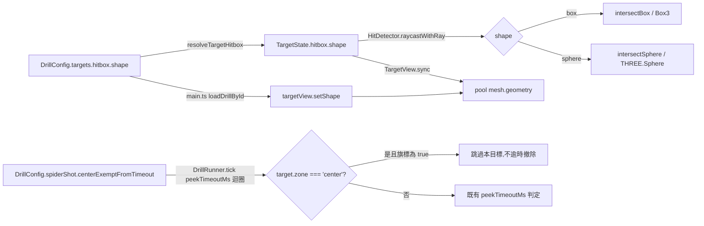

# WP-46(暫用編號)— spider-shot-v2-aimlab-parity:球體目標 + Aim Lab 對齊調參

> stage9 提案的 WP 子資料夾。上層 spec:[../README.md](../README.md)。
> Companion:[task-checklist.md](task-checklist.md) · [progress.md](progress.md)
> 觸發:使用者實機測試 [WP-44](../wp-44-spider-shot-v2-stratified/README.md) 交付的 `spider-shot-v2` 後回報「生成邏輯不符預期」,經 [systematic-debugging](../../../../../CLAUDE.md) 排查後排除 sim 邏輯 bug(交替/重置/spawn 時序皆正確、有測試覆蓋),真正原因是候選值 `angularRadiusDegRange=[10,25]` 太難搜尋、目標外觀非球體。經 brainstorming 對話與使用者對照 Aim Lab Spidershot 逐項核對後,拍板本 WP 範圍。

| | |
|---|---|
| **目標** | 讓 `spider-shot-v2` 在幾何/時序/命中判定三個維度上對齊 Aim Lab Spidershot 的實測手感:球體目標(真碰撞,非視覺近似)、中心目標無個別逾時、60 秒整場時限、視角直徑換算的精準 hitbox |
| **里程碑** | 無獨立里程碑(T-exit gate 即交付判定,比照 WP-27/WP-44 精神);暫定併入字母 I(stage9,未正式指派,見 [../README.md](../README.md) OQ-S9-2) |
| **相依** | [WP-44](../wp-44-spider-shot-v2-stratified/README.md)(已交付;本 WP 修改其產出的 `spider_shot_v2.ts`) |
| **估時** | 2.5–4 dev-days |
| **狀態** | ⬜ 規劃完成,尚未開跑 T0 |

---

## 0. 讀碼對帳(brainstorming 對話,2026-08-26)

1. **sim 邏輯本身無 bug**:`TargetManager.sampleSpiderShotPose()`/`markKilled()` 的 center↔peripheral 嚴格交替、單一 active 目標、擊殺/超時即撤即補,皆與設計相符且有 `TargetManager.test.ts:754-867` 覆蓋。使用者回報的「太慢」實為:(a) 外圍目標在 10°–25° 全向搜尋無提示、(b) 目標是方塊非球體、(c) 沒有明確的整場時限/中心無逾時語意對齊 Aim Lab。
2. **WP-45 的 hitscan wall-block occlusion gate(`SimLoop.ts` / `occlusionGeometry.ts`)與本 WP 無關**:spider-shot 系列綁定的 `placeholder-room` 場景 `propBounds: []`,遮擋判定恆不觸發;且該 gate 是 `SimLoop.ts` 內對「已命中的目標」做穿牆二次檢查,與 `HitDetector.raycastWithRay` 內部的 hitbox 幾何判定是不同層,新增 sphere 分支不會與其互相干擾。
3. **GD-7 的第一次收斂(WP-23,已交付)把 on-target 幾何釘死為「H1 hitbox(Box3)」**——`docs/exec-plan/DECISIONS.md` GD-7 條目原文:「on-target(逐 tick 二元)= 準心射線 ∩ H1 hitbox(Box3)——與命中判定同一套幾何、零新門檻參數」。本 WP 是對 GD-7 這個 Box3 措辭的**第二次修訂**(擴充為 box|sphere,單一來源原則不變),非新開一條無關決策。
4. **`spiderShotConditions.ts` 不需要碰**:`deriveSpiderShotTransitions()` 對 `hitbox.width` 的用法(`angularSizeDeg = 2·atan((width/2)/distance)`)本來就把它當「目標特徵直徑」用,不做任何 box 專屬幾何運算(無角點/面法向量計算)——sphere(`width=height=depth=直徑`)套進同一公式語意不變,T5 不需要改這個檔案。
5. **`trackingDerivation.ts` 不受影響**:它是 WP-18 追蹤/presentation 類 drill 的**逐 tick on-target 離線重建**模組,spider-shot 系列不設 `presentationMs`,不會呼叫進這條路徑;`shape` 欄位不需要傳進 `trackingDerivation.ts` 的 `HitboxSize`。
6. **stage9 內部無檔案熱區衝突**:[WP-45](../wp-45-peek-click-transfer/README.md) 已交付(`c1ba124`),不再是並行工作;本 WP 觸碰的 `src/drill/DrillConfig.ts`/`src/drill/schema.ts`/`src/main.ts` 與 WP-45 交付時的版本已經是同一份,無需再協調排程。

---

## 1. 需求

### Functional Requirements

- **FR-46.1**:系統必須支援 `DrillConfig.targets.hitbox.shape: 'sphere'`,且該目標的**命中判定**(`HitDetector.raycastWithRay`)必須以真正的球體相交(`THREE.Ray.intersectSphere`)計算,不得退化為 box 近似。
- **FR-46.2**:`shape` 省略或為 `'box'` 時,命中判定與渲染必須與現行行為逐位不變(既有 27 個消費 `.hitbox` 的檔案零回歸)。
- **FR-46.3**:`shape: 'sphere'` 時,`TargetView` 必須渲染球體 mesh,且視覺球體直徑等於判定用直徑(`widthU`,強制 `widthU === heightU === depthU`)——視覺與判定同幾何,不產生「看起來沒中但算命中」或反向的落差。
- **FR-46.4**:`spider-shot-v2` 的中心目標(`zone: 'center'`)必須不受 `timing.peekTimeoutMs` 個別逾時影響;`spider-shot-v1` 的中心目標逾時行為必須逐位不變。
- **FR-46.5**:`spider-shot-v2` 整場結束條件必須改為 60 秒時限(`endCondition: {type:'timeLimit', value:60000}`),且 spawn 上限(`targets.count`)不得在 60 秒內提前耗盡。
- **FR-46.6**:`spider-shot-v2` 的 hitbox 直徑必須由「距離 8u、視角直徑 2.0°」的球面幾何公式換算而來,公式必須以程式碼常數 + 註解呈現(可稽核),不得手打無來源的魔術數字。

### Non-functional Requirements

- **NFR-46.1**:`npm run test:ci`(`tsc --noEmit` + `vitest run` + `playwright test`)全綠,且既有測試檔案 0 個被刪除或跳過。
- **NFR-46.2**:`spider-shot-v1` 的既有回歸測試(世界座標精確斷言、`TargetManager.test.ts` WP-36 區塊、`spider_shot_v2.test.ts` 既有「v1 逐位不變」案例)必須全數維持綠燈,不修改其斷言值。
- **NFR-46.3**:新增的 sphere 相交分支必須維持 `HitDetector.raycastWithRay` 現有的零配置(GC)紀律——複用模組層級 `THREE.Sphere` 重用物件,不在熱路徑 `new`。

### Constraints

- 不得修改 `src/drill/spider_shot_v1.ts`(WP-39 凍結值)。
- 不得修改 `src/metrics/spiderShotConditions.ts`/`spiderShotMetrics.ts`(§0-4 讀碼結論)。
- `docs/exec-plan/DECISIONS.md` 本次**不**寫入正式 GD 編號(T0 覆核修正:GD-25 已於 WP-45 T-exit 正式落帳為完整決議,非「stage8 暫用」佔位——下一個可用號為 GD-26;本 WP 仍延後指派,比照 WP-44/WP-45 T-exit 的延後處置,理由不變)——實質決策記在本 WP `progress.md` Decision Log,`CLAUDE.md §4` 直接更新措辭(比照 WP-23 前例:CLAUDE.md 更新早於正式 GD 編號落帳)。

### Open Questions

| # | 問題 | 目前傾向 | Owner | Deadline |
|---|---|---|---|---|
| OQ-46.1 | `targets.count` 安全上限精確值(300 是否足夠/過大) | 300(60s 內任何合理擊殺速率都到不了) | 使用者 | T5 前確認,不阻塞 T0-T4 |
| OQ-46.2 | 本 WP 的正式 WP/GD 編號指派時機 | 延後,比照 stage9 OQ-S9-2 | 使用者 | 不阻塞本 WP 交付 |

---

## 2. 技術設計

### System boundary

**In scope**:

```
CLAUDE.md                            ← MODIFY §4 GD-7 hitbox 措辭(box → box|sphere)                          [T1]
src/drill/DrillConfig.ts             ← MODIFY TargetHitboxConfig/TargetHitboxSize 新增 shape 欄位;
                                        SpiderShotCenterPeripheralConfig/SpiderShotStratifiedConfig 新增
                                        centerExemptFromTimeout?                                              [T1,T4]
src/drill/schema.ts                  ← MODIFY sphere 時 widthU=heightU=depthU 驗證;
                                        centerExemptFromTimeout 布林驗證                                       [T1,T4]
src/state/types.ts                   ← MODIFY TargetState.hitbox inline type 新增 shape                        [T1]
src/sim/HitDetector.ts               ← MODIFY raycastWithRay 新增 sphere 相交分支                               [T2]
src/render/TargetView.ts             ← MODIFY 新增 setShape() 切換 pool mesh geometry                          [T3]
src/main.ts                          ← MODIFY 載入 drill 時呼叫 targetView.setShape()                          [T3]
src/drill/DrillRunner.ts             ← MODIFY peekTimeoutMs 迴圈依 centerExemptFromTimeout 跳過 center zone     [T4]
src/drill/spider_shot_v2.ts          ← MODIFY hitbox(sphere)/timing/spiderShot/endCondition/targets.count      [T5]
docs/exec-plan/DECISIONS.md          ← 本次不動(延後,見 §0-3 / Constraints)
```

**Out of scope**:

- `src/drill/spider_shot_v1.ts`、`src/metrics/spiderShotConditions.ts`、`src/metrics/spiderShotMetrics.ts`、`src/metrics/trackingDerivation.ts`——零改動(§0 讀碼結論)。
- 真人 pilot / 正式校準凍結——本 WP 產出的數值(2.0° 視角直徑、1750ms 逾時)仍是候選值,比照 WP-44 `angularRadiusDegRange` 的「候選、非凍結」聲明方式。
- 音效/視覺方向提示(cue)——brainstorming 對話中使用者明確選擇不需要。
- 外圍目標存活時間隨機化——使用者明確選擇固定單一值。

### Data flow



### Interface contracts

```ts
// src/drill/DrillConfig.ts                                                          [T1]
export interface TargetHitboxConfig {
  widthU: number;
  heightU: number;
  depthU: number;
  /** 省略 = 'box'(既有行為逐位不變)。'sphere' 要求 widthU === heightU === depthU（schema.ts 驗證）。 */
  shape?: 'box' | 'sphere';
}

export interface TargetHitboxSize {
  width: number;
  height: number;
  depth: number;
  /** resolveTargetHitbox() 恆填實值,預設 'box'。 */
  shape: 'box' | 'sphere';
}

// src/drill/DrillConfig.ts                                                          [T4]
export interface SpiderShotCenterPeripheralConfig {
  kind: 'center-peripheral';
  seed: number;
  centerDistanceU: number;
  peripheral: SpiderPeripheralConfig;
  /**
   * true 時,zone==='center' 的目標不受 timing.peekTimeoutMs 影響(只靠 endCondition/timing.timeLimitMs
   * 的整場後援閘)。省略/false = 現行行為逐位不變(spider-shot-v1 必須維持省略)。
   */
  centerExemptFromTimeout?: boolean;
}
// SpiderShotStratifiedConfig 同步新增同一欄位(型別對稱)。
```

```ts
// src/sim/HitDetector.ts                                                            [T2]
// raycastWithRay 內部 per-target 迴圈新增分支(既有簽名不變):
if (t.hitbox.shape === 'sphere') {
  sphere.center.set(cx, cy, cz);
  sphere.radius = t.hitbox.width / 2;
  const point = raycaster.ray.intersectSphere(sphere, hitPoint);
  if (point === null) continue;
  // ...其餘 nearest-hit 比較邏輯與 box 分支共用
} else {
  // 既有 Box3 路徑,逐位不變
}
```

```ts
// src/render/TargetView.ts                                                          [T3]
export class TargetView {
  // 既有 constructor(scene) 簽名不變（預設 'box' geometry）。
  /** 切換 pool 共用 geometry(box/sphere);既有 pool mesh 就地換 geometry,不重建/不銷毀。 */
  setShape(shape: 'box' | 'sphere'): void;
}
```

### Failure modes

| 觸發 | 影響 | 處理 |
|---|---|---|
| `shape: 'sphere'` 但 `widthU !== heightU !== depthU` | 球體半徑該用哪個維度不明確,渲染/判定可能不一致 | `schema.ts` 明確拒絕(丟出清楚錯誤訊息「sphere 要求三軸相等」),T1 DoD 含此負向測試 |
| `TargetView.setShape()` 在 pool 已有 mesh 時呼叫,但漏改某個 pooled mesh 的 geometry | 換 drill 後仍有殘留舊形狀的 mesh(視覺 bug,但不影響判定,因為判定讀 `TargetState.hitbox` 不讀 mesh) | T3 DoD 明文要求「pool 內全部既有 mesh 的 geometry 參照都指向新 geometry」的測試 |
| `centerExemptFromTimeout` 迴圈判斷寫反(誤跳過 peripheral 而非 center) | spider-shot-v2 外圍目標變成無限等待,60 秒時限才會結束,體感更差(反效果) | T4 DoD 明文要求「center 例外時 peripheral 仍照常逾時」的正向測試 |
| sphere 分支忘記 clamp `subAlpha`(沿用既有 box 分支的 posPrev 內插) | sub-tick 命中內插在 sphere 目標上失效,移動目標(若未來 spider-shot 加 motion)命中判定失準 | 本 WP 的 spider-shot-v2 是 static 目標,不觸發此路徑;T2 DoD 仍要求 sphere 分支重用既有 `cx/cy/cz`(含 subAlpha 內插)變數,不得重新引入一套座標運算 |

### Concurrency model

**N/A**(沿用既有單 rAF 超級迴圈,ADR-2)。本 WP 不新增計時來源、不新增 worker/thread。

---

## 3. 風險分析

| Task | Risk | 理由 |
|---|---|---|
| T1 | Med | 修改 GD-7 措辭 + 型別擴充,影響面涵蓋所有讀 `.hitbox` 的 23 個檔案(§Blast radius);但 additive + 預設值保護,實際回歸風險靠既有測試矩陣兜底 |
| T2 | Med | 新幾何路徑(sphere 相交)無先例,若計算錯誤不會 crash 但會產生「判定範圍與視覺不符」的靜默 bug——測試需覆蓋「命中球心」「命中球體邊緣內」「命中球外但在外接方塊內(必須 miss)」三種案例區分 sphere 與 box 判定的實際差異 |
| T3 | Low | 純渲染切換,不影響任何判定/資料;失敗模式最多是視覺不正確,不影響量測效度 |
| T4 | Low-Med | 邏輯簡單(一個條件式),但正向/負向測試都要覆蓋(center 例外 + v1 不受影響 + peripheral 仍逾時) |
| T5 | Low | 純資料值變更,風險在於忘記同步移除 `timing.timeLimitMs`(冗餘來源)或 `targets.count` 設太低卡住 spawn |

**Technical debt**:GD-7 的 sphere 幾何是「有意識的擴充」,非妥協;`docs/exec-plan/DECISIONS.md` 正式 GD 編號延後屬有意識延後(見 Constraints),觸發正式落帳的條件 = 使用者確認要一次性指派 stage9 的 WP/GD 編號(比照 stage8 OQ-S8-4)。

---

## 4. Task 索引

| Task | 檔案 | Objective | 相依 | Risk | 估時 |
|---|---|---|---|---|---|
| **T0** | [T0-entry-gate.md](T0-entry-gate.md) | 覆核 §0 讀碼假設仍成立;無程式碼 | 無 | Low | 0.25d |
| **T1** | [T1-hitbox-shape-gd7.md](T1-hitbox-shape-gd7.md) | `TargetHitboxConfig`/`TargetHitboxSize`/`TargetState.hitbox` 新增 `shape`;`schema.ts` sphere 驗證;`CLAUDE.md §4` GD-7 措辭更新 | T0 | Med | 0.75d |
| **T2** | [T2-hitdetector-sphere.md](T2-hitdetector-sphere.md) | `HitDetector.raycastWithRay` 新增 sphere 相交分支 + 測試 | T1 | Med | 0.75d |
| **T3** | [T3-targetview-render.md](T3-targetview-render.md) | `TargetView.setShape()` + `main.ts` 接線 + 測試 | T1 | Low | 0.5d |
| **T4** | [T4-center-timeout-exemption.md](T4-center-timeout-exemption.md) | `centerExemptFromTimeout` 欄位 + `DrillRunner.ts` 邏輯 + 測試(含 v1 regression) | T1 | Low-Med | 0.5d |
| **T5** | [T5-spider-shot-v2-config.md](T5-spider-shot-v2-config.md) | `spider_shot_v2.ts` 數值更新(hitbox/timing/spiderShot/endCondition) + 測試 | T2, T3, T4 | Low | 0.5d |
| **T-exit** | [T-exit-gate.md](T-exit-gate.md) | 驗收;`npm run test:ci` 全綠;文件對帳(含 GD-7 延後記錄) | T1+T2+T3+T4+T5 | — | 0.25d |

一 task = 一垂直切片 = 一原子 commit 紀律不變。T2/T3 檔案互不重疊(`HitDetector.ts` vs `TargetView.ts`+`main.ts`),理論上可並行,但單一 agent 執行時建議照編號順序。

---

## 5. 文件對帳清單(T-exit 執行)

- [ ] `CLAUDE.md §4`:GD-7 hitbox 措辭由「box」擴充為「box|sphere」(T1 執行,非 T-exit)。
- [ ] `docs/operational/analysis-spider-shot.md`:補充 `spider-shot-v2` 的 hitbox shape / 60 秒時限 / center 無逾時 三項契約說明。
- [ ] `docs/exec-plan/DECISIONS.md`:**延後**(比照 WP-44/45,理由見 §0-3/Constraints)。
- [ ] `../README.md`(stage9 頂層)§5:新增 WP-46 列。
- [ ] `docs/exec-plan/README.md`/`docs/MAP.md`:延後,同 WP-44/45 處置。
