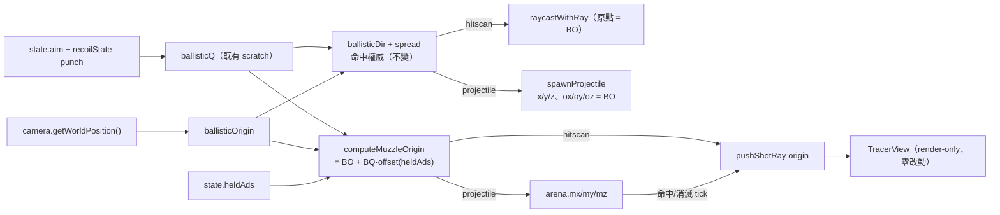

# WP-27 — muzzle-tracer:tracer 從槍口射出 + ADS 槍口移置準心下方

> **狀態:✅ 已交付(2026-08-04)**,編號 **WP-27**(GD-18);單 WP 自足資料夾,無獨立里程碑(exit gate = 三不變性驗收)。
> 上層索引:[exec-plan/README.md](../../README.md) · 決議帳本:[DECISIONS.md](../../DECISIONS.md) **GD-18** · 術語:[CONTEXT.md](../../../../CONTEXT.md)
> Companion:[task-checklist.md](task-checklist.md) · [progress.md](progress.md)
> 家族:延伸 **WP-25 tracer**([completed/stage5/wp-25-ballistics-tracer](../stage5/wp-25-ballistics-tracer/README.md));ADS 沿 **WP-24**([wp-24-ads-optics](../stage5/wp-24-ads-optics/README.md));前置 bug 修 **BD-002 / KI-002 D1**([BUGFIX-DECISIONS.md](../../../known_issue/BUGFIX-DECISIONS.md))。

| | |
|---|---|
| **一句話** | 讓 tracer(子彈軌跡顯示)的**視覺起點**從畫面中心(準心)改為**槍口位置**(hip = 右手持槍位),並在**開鏡(ADS)**時把槍口移到**準心下方**;命中判定與彈道物理**完全不變**(仍從相機中心)。 |
| **性質** | render-only 視覺增強(WP-25 tracer 家族);**非** bug 修復、**非**命中/效度變更、**非**新增匯出欄位。 |
| **對應 FR** | 本 WP 自有 FR-MT1~MT5(§1.1);延伸 FR-E7(tracer 顯示),ADS 消費 FR-E4(`heldAds`)。 |
| **前置相依** | **KI-002 D1 ✅ 已落地**(BD-002,2026-07-15):相機中心 = sim origin = 準心 → 偏移基準已正確(§2 C-0)。 |
| **估時** | 1.75–2.75 dev-days(T0 0.25 + T1 0.75–1 + T2 0.5–1 + T-exit 0.25–0.5);ADS 偏移量**實機量測**研究成本另計(OQ-MT-2)。 |

---

## 0. 讀碼核實 — 與初版草稿不符的五項發現

> 2026-08-03 規劃期讀碼結論。**這五項直接改寫了契約與 task 拆解**,是本計畫與初版草稿的主要差異。

| # | 初版草稿假設 | 讀碼實況 | 對計畫的影響 |
|---|---|---|---|
| **F-1** | C-0 前置「KI-002 D1 必須先落地」狀態未知 | **已落地** — BD-002 ✅ D1+D2 修於 2026-07-15;`br-field` 設 `eyeZ:0`,camera = sim origin | T0 唯一阻塞相依已解,entry-gate 降為基線核對 |
| **F-2** | 「三個 `pushShotRay` 點改用 muzzleOrigin」 | 三點分屬**兩種來源**:hitscan 用 scratch `ballisticOrigin`([SimLoop.ts:431](../../../../src/loop/SimLoop.ts#L431));projectile 兩點用 **`arena.ox/oy/oz`**([:324](../../../../src/loop/SimLoop.ts#L324) / [:353](../../../../src/loop/SimLoop.ts#L353))。而 `arena.o*` **同時是 `maxRangeU` 與落地判定的距離基準**([:339-343](../../../../src/loop/SimLoop.ts#L339-L343)) | **直接覆寫 `arena.o*` 會改變子彈存活/落點物理 → 違反 C-1**。必須在 `BulletArena` 另加 `mx/my/mz` 三欄(預配置 typed-array)→ **契約 C-1b** |
| **F-3** | C-4:`muzzleOrigin = ballisticOrigin + R(cameraWorldQuat)·offset` | camera 的 quaternion 由 **render loop** 每幀寫入(`CameraController` + 內插 punch)。既有 `ballisticRaycast` **刻意不讀 camera quaternion**,只用 `state.aim + rawPunch×2` 合成模組層 scratch `ballisticQ`([:127-133](../../../../src/loop/SimLoop.ts#L127-L133)) | 讀 `camera.getWorldQuaternion()` 會讓 sim 依賴 render FPS → **破壞決定性**。改用既有 `ballisticQ`(零額外計算、與彈道方向同源、capture-at-fire 天然成立)→ **契約 C-4 改寫** |
| **F-4** | hip 初值 `[+0.18, -0.12, +0.10]` | 前向分量最小 → muzzle 落在光軸外 ≈ 63°(畫面外)。相機近處世界尺度讀作公尺(`SceneManager` 眼高 ~1.6),真實 FPS 比例為**前向 ≫ 側向**;且草稿「前 = +z」與 THREE(前 = **−Z**)相反 | 初值改為 `{right 0.15, up −0.12, forward 0.60}`(右 ≈14°、下 ≈11°);符號慣例於介面明文釘死 → **契約 C-6** |
| **F-5** | 「新增測試」 | [SimLoop.test.ts:432](../../../../src/loop/SimLoop.test.ts#L432) **硬斷言** tracer origin `== [0,1.5,5]`(= camera 位置);[projectile-determinism.test.ts](../../../../tests/regression/projectile-determinism.test.ts) 的 `tracers` 是 run-vs-run 跨 FPS 比較、**非**存檔 golden | 前者為 T1 **唯一允許修改**的既有斷言(預期變更);後者應**零修改全綠**,直接充當 C-4 決定性證據 |

---

## 1. 需求(Requirements)

### 1.1 Functional Requirements

| # | 系統必須… | 映射 |
|---|---|---|
| **FR-MT1** | 在開火 tick 以 **muzzle 世界座標**作為 `shotRays` 的 origin 寫入,涵蓋 hitscan 與 projectile 兩條路徑;該座標於開火 tick 凍結,後續 tick / 視角變動不重算 | T1 |
| **FR-MT2** | 維持命中權威**逐位不變**:`ballisticRaycast` 射線原點、`spawnProjectile` 的 `arena.x/y/z` 與 `arena.ox/oy/oz`(maxRange/落地基準)、命中結果、事件內容全部不因本變更而改變 | T1 |
| **FR-MT3** | 在開火 tick 依 `state.heldAds` 選用 hip / ads 偏移向量,ads 態下 muzzle 位於準心下方 | T2 |
| **FR-MT4** | muzzleOrigin 為決定性純函式輸出:偏移為常數 config 向量,旋轉取自 sim 側 `ballisticQ`;不讀時鐘、不讀 `Math.random`、不讀 render 端 camera 朝向 | T1 / T2 |
| **FR-MT5** | 不新增任何匯出欄位、事件或指標;`schemaVersion` 不動 | T-exit |

### 1.2 Non-functional Requirements

| 類別 | 量化需求 |
|---|---|
| 決定性 | `tests/regression/projectile-determinism.test.ts`(跨 FPS run-vs-run,含 `tracers` 欄)**零修改全綠**;新增 muzzle 決定性 fixture 同輸入逐位一致 |
| 零破壞 | 命中/彈道/彈孔/事件既有測試**零修改全綠**;唯一允許修改的既有斷言 = [SimLoop.test.ts:432](../../../../src/loop/SimLoop.test.ts#L432),且須改為**顯式期望值**(`camPos + R·hipOffset` 逐位),不得放寬為 `toBeCloseTo` 或刪除 |
| GC 紀律 | 開火熱路徑零配置:模組層 scratch `Vector3` 複用;`BulletArena` 新增欄位為預配置 `Float64Array(BULLET_CAP)`,無 realloc |
| 效度 | export fixture diff = **0 bytes**;`shotRays` / `arena.m*` 全 repo 無 `src/data/` 引用 |
| CI | `tsc --noEmit` 0;`npm run test:ci` exit 0 |

### 1.3 Constraints

沿用 [CLAUDE.md §4](../../../../CLAUDE.md) 全部硬約束;本 WP 直接受制於 **GD-6**(子彈/tracer 不碰場景幾何)、**WP-25**(tracer render-only、不進 export)、**GD-16**(ADS 只落 input/render/data)、**GD-17**(彈道 config-gated、固定步長純函式)。**不新增**硬約束,只在 CLAUDE.md §4 既有 tracer 條目後補一句:「tracer origin 為 muzzle 偏移,與命中/彈道原點分離」。

---

## 2. 關鍵契約

| # | 契約 | 來源 |
|---|---|---|
| **C-0** | KI-002 D1 已落地 → muzzle 偏移基準 = sim origin = 準心 | ✅ 已滿足(BD-002),T0 形式核對 |
| **C-1** | **命中權威不動**:`ballisticOrigin` 仍 = `camera.getWorldPosition()`;`arena.x/y/z` 與 **`arena.ox/oy/oz`** 皆維持彈道原點語意(後者是 maxRange/落地基準,**非** tracer 用);`pushImpact`(彈孔 = 命中點)**不動** | F-2 |
| **C-1b** | muzzle 世界座標寫入 `BulletArena` 新增的 `mx/my/mz` 欄,**僅** tracer 消費,不參與任何命中/存活判定;與 `o*` 並存 | F-2 |
| **C-2** | render-only:`shotRays` 環未被 `src/data/` 引用,改 origin 不動任何匯出/指標(WP-25)。tracer 亦是 projectile 的**唯一**視覺 → 一套 muzzle origin 同時涵蓋 hitscan 與 projectile | WP-25 |
| **C-3** | **capture-at-fire**:hitscan 於 `fireOneShot` 內即算即寫;projectile 於 `spawnProjectile` 寫 `m*`,`advanceProjectiles` 只讀 → 開火後轉視角 tracer 不游移 | OQ-MT-3 ✅ |
| **C-4** | `muzzleOrigin = ballisticOrigin + ballisticQ · offsetVec`,`ballisticQ` = **既有 sim 側 scratch**(`aim.yaw/pitch + rawPunch×2`)。禁讀 camera world quaternion、禁時鐘、禁 `Math.random`。副作用(可接受):punch 期間槍口與彈道嚴格同源擺動 | F-3 |
| **C-5** | ADS = 開火 tick 讀 `state.heldAds`(sim 側已維護,[SimLoop.ts:86](../../../../src/loop/SimLoop.ts#L86))選向量;不改 `SIM_HZ` / 命中幾何 / 彈道語意;`heldAds` 的事件 + 逐 tick flag 記錄維持 WP-24 現狀 | GD-16 |
| **C-6** | `offsetVec` 定義於 **THREE camera-local**:`+X = 右`、`+Y = 上`、**`−Z = 前`**;介面以 `rightU / upU / forwardU`(forward 正值 = 向前)表達,內部轉 −Z | F-4 |
| **C-7** | hip↔ads 為**階躍**,不做平滑內插 —— tracer origin 是 capture-at-fire 的 sim 值,而平滑內插必然是 render 幀狀態,兩者互斥;且與 GD-16「ADS gain 階躍」慣例一致 | OQ-MT-6 ✅ |

---

## 3. 系統設計(Technical Design)

### 3.1 System boundary

**In scope**:
```
src/render/muzzleOffset.ts        ← ADD 偏移常數 + computeMuzzleOrigin 決定性純函式        [T1/T2]
src/state/SharedState.ts          ← MODIFY BulletArena additive mx/my/mz 三欄(C-1b)        [T1]
src/loop/SimLoop.ts               ← MODIFY 四處切口(§3.3 表);raycast/spawn 引數不動        [T1/T2]
src/render/muzzleOffset.test.ts   ← ADD 旋轉/符號慣例/零配置 單元測試                       [T1]
src/loop/SimLoop.test.ts          ← MODIFY 僅 :432 一案(顯式期望值)                        [T1]
tests/regression/muzzle-tracer-invariants.test.ts ← ADD 命中權威不動 + 決定性 + ADS 切換     [T1/T2]
docs/ + CONTEXT.md + CLAUDE.md    ← MODIFY 術語/硬約束/索引對帳                             [T0/T-exit]
```

**Out of scope**(明確排除):
- **改命中幾何 / 彈道物理**:raycast 與 projectile spawn 恆從相機中心(C-1)。**永久紅線**。
- **可見武器模型 / view-model 動畫**(手臂、槍身 mesh、bob/sway):本 WP 只動 tracer 起點,不建 viewmodel。觸發 = 明確視覺需求立案。
- **tracer 進匯出 / 進指標**:`shotRays` / `arena.m*` 為 render-only,不進 export、不進命中語意(WP-25 硬約束)。
- **`TracerView` 縮尾方向改造**:現行以 origin 為固定端縮短([TracerView.ts:148-163](../../../../src/render/TracerView.ts#L148-L163));觸發 = T-exit 視覺驗收判定不可接受(OQ-MT-7)。
- **per-weapon 槍口偏移**(晉升 `WeaponConfig`):觸發 = 出現第二把幾何差異顯著的武器。
- **子彈對場景幾何互動**(GD-6 紅線,永久排除)。

### 3.2 資料流(開火 tick)



雙迴圈邊界不變(ADR-2):sim 只多算一個向量、多寫三個 typed-array 欄;render 端 `TracerView` / `Controls` / `src/data/` / `src/metrics/` **零改動**。

### 3.3 Interface contracts

```ts
// src/render/muzzleOffset.ts（新;零 DOM 相依,僅用 THREE 向量型別）

/** view-space 槍口偏移。THREE camera-local:+X 右、+Y 上、−Z 前(C-6)。 */
export interface MuzzleOffset {
  readonly rightU: number;
  readonly upU: number;
  /** 正值 = 向前(內部轉為 −Z)。 */
  readonly forwardU: number;
}

export interface MuzzleOffsets {
  readonly hip: MuzzleOffset;   // GD-18 初值 { rightU: 0.15, upU: -0.12, forwardU: 0.60 }
  readonly ads: MuzzleOffset;   // T2 實測值 { rightU: 0,    upU: -0.065, forwardU: 0.60 }（OQ-MT-2 ✅）
}

export const DEFAULT_MUZZLE_OFFSETS: MuzzleOffsets;

/**
 * 決定性純函式:out = origin + quat·(rightU, upU, −forwardU)。
 * 不讀時鐘 / 亂數 / render 狀態;寫入呼叫端提供的 out(熱路徑零配置)。
 * @returns 傳入的 out
 */
export function computeMuzzleOrigin(
  origin: THREE.Vector3,
  quat: THREE.Quaternion,
  ads: boolean,
  offsets: MuzzleOffsets,
  out: THREE.Vector3,
): THREE.Vector3;
```

```ts
// src/state/SharedState.ts（MODIFY:BulletArena additive 三欄,比照既有欄位式佈局）
export interface BulletArena {
  // …既有欄位不動(ox/oy/oz 維持彈道原點 = maxRange/落地基準,C-1)
  /** 開火 tick 凍結的槍口世界座標;**僅** tracer 消費,不參與任何命中/存活判定(C-1b)。 */
  readonly mx: Float64Array;
  readonly my: Float64Array;
  readonly mz: Float64Array;
}
```

**SimLoop 改動點(共 4 處,皆為最小切口)**:

| # | 位置 | 改動 |
|---|---|---|
| 1 | `fireOneShot` hitscan 分支 [:429-440](../../../../src/loop/SimLoop.ts#L429-L440) | `ballisticRaycast` 之後、`pushShotRay` 之前算 `muzzleScratch`;`pushShotRay` 的 origin 三引數改用之(**`pushImpact` 不動**) |
| 2 | `spawnProjectile` [:234-236](../../../../src/loop/SimLoop.ts#L234-L236) | `arena.o*` **維持** `ballisticOrigin`;**新增**寫入 `arena.m*` = `muzzleScratch` |
| 3 | `advanceProjectiles` 命中 [:324](../../../../src/loop/SimLoop.ts#L324) | `pushShotRay` origin `arena.o*` → `arena.m*` |
| 4 | `advanceProjectiles` 消滅 [:353](../../../../src/loop/SimLoop.ts#L353) | 同上;⚠️ [:339-343](../../../../src/loop/SimLoop.ts#L339-L343) 的 `d0/d1` **仍用 `arena.o*`** |

### 3.4 Concurrency model

無變更:單執行緒單 rAF 超級迴圈;`shotRays` / `bullets` 仍是 sim 寫、render 唯讀的單向 `SharedState` 流;無新增共享可變狀態、無 worker、無鎖。

---

## 4. Failure modes

| 觸發 | 影響 | 處理 |
|---|---|---|
| 誤把 muzzle 套進 `arena.ox/oy/oz` | maxRange/落地距離基準偏移 → **子彈存活長度改變、命中數改變** | 回歸測試斷言 `arena.o*` 逐位 == camera world pos;`projectile-determinism.test.ts` 零修改全綠為 T1 DoD 首項 |
| 誤把 muzzle 套進 raycast / spawn 位置 | 命中幾何偏移、研究效度破壞 | 新增 `muzzle-tracer-invariants.test.ts` 顯式斷言(比照 BD-002 的 `br-camera-anchor-invariants.test.ts` 封盲區手法) |
| 用 `camera.getWorldQuaternion()` 取旋轉 | sim 依賴 render 幀 → **跨 FPS 決定性紅** | C-4 釘死用 `ballisticQ`;決定性 fixture 以兩組不同 frame sequence 跑同輸入 |
| 熱路徑每發 `new Vector3/Quaternion` | 高射速 GC 卡頓汙染量測 | 模組層 `muzzleScratch` 單例 + `computeMuzzleOrigin` 寫入 out;code review 檢查點 |
| `pushImpact` 也被改成 muzzle | 彈孔位置錯亂(彈孔 = 命中點,與 tracer 無關) | 改動清單明列「`pushImpact` 不動」;既有彈孔測試零修改全綠 |
| forward 分量過小 | muzzle 落在光軸 60°+ → 畫面外,看起來像沒生效 | GD-18 初值(前向 ≫ 側向)+ T1 手動視覺驗收截圖 |
| ADS 偏移量未經實機驗證即定 | tracer 觀感不真實(不影響正確性) | ✅ T2 以 Edge FHD/QHD 三候選實測,選定 `upU:-0.065`;方法與證據見 progress |
| tracer 縮尾方向觀感 | origin 從眼睛(看不見)移到槍口後,**縮尾行為第一次真正可見**,可能讀作「線往槍口縮回」而非「子彈往前飛」 | 列入 T-exit 手動視覺驗收(OQ-MT-7);不可接受則另開 task(本 WP out of scope) |

---

## 5. Task 索引

| Task | 檔案 | Objective | 相依 | Risk | Cplx | 估時 |
|---|---|---|---|---|---|---|
| **T0** | [T0-entry-gate.md](T0-entry-gate.md) | 基線核對(KI-002 D1 ✅ / `test:ci` 乾淨基準)+ 讀碼證據 F-2/F-3/F-5 記帳 + CLAUDE.md §4 補句 + OQ-MT-2 量測任務登記 | — | Low | Low | 0.25 |
| **T1** | [T1-hip-muzzle-tracer.md](T1-hip-muzzle-tracer.md) | `muzzleOffset.ts` + `BulletArena.m*` + SimLoop 四處切口;hip 單一路徑 | T0 | **Med** | Low-Med | 0.75–1 |
| **T2** | [T2-ads-muzzle.md](T2-ads-muzzle.md) | `heldAds` 分支 + ads 偏移量回填 + 階躍切換 | T1(數值需 OQ-MT-2) | Low-Med | Low | 0.5–1 |
| **T-exit** | [T-exit-gate.md](T-exit-gate.md) | 三不變性總驗 + 手動視覺驗收 + 索引/帳本對帳 | T1–T2 | — | — | 0.25–0.5 |

### 驗證總表(契約 → 驗證)

| 契約 | 驗證手段 |
|---|---|
| C-1 / C-1b 命中權威不動 | `muzzle-tracer-invariants.test.ts` 逐位斷言 raycast 原點 + `arena.o*`;既有命中/彈孔/事件測試零修改全綠 |
| C-2 render-only | export fixture diff 0;`shotRays` / `arena.m*` 無 `src/data/` 引用(grep 為 DoD 檢查項) |
| C-3 capture-at-fire | 開火後改 `state.aim` 再跑數 tick,已寫入 ring 的 origin 不變 |
| C-4 決定性 | `projectile-determinism.test.ts` 零修改全綠 + 新 muzzle 跨 FPS fixture |
| C-5 / C-7 ADS 階躍 | T2 DoD ①②;斷言無中間內插值 |
| C-6 符號慣例 | `muzzleOffset.test.ts` 對 identity quaternion 斷言 `out.z === origin.z − forwardU` |

---

## 6. 風險分析

| 風險 | 等級 | 說明與緩解 |
|---|---|---|
| 命中污染(唯一嚴重風險) | **High → 測試後 Low** | F-2 使它比初版估計**更易誤觸**(`arena.o*` 看起來像純 tracer 欄位,實則是物理基準)。緩解 = C-1b 分離欄位 + 新回歸檔顯式封盲區(沿用 BD-002 已驗證手法);C-1 為 T1 DoD 首項 |
| 決定性破壞 | Med → Low | F-3 已在設計階段消除主要陷阱;`projectile-determinism` 零修改全綠即為充分證據 |
| 相依風險 | ~~Med~~ → **已消** | KI-002 D1 已落地(BD-002) |
| 經驗成本(非 code) | ~~Med~~ → **已消** | OQ-MT-2 已以 Edge FHD/QHD 實測並回填;介面維持不變 |
| **Technical debt(有意識妥協)** | — | ① projectile 物理從相機中心飛、tracer 從槍口起,兩者在 endpoint 收斂(真實遊戲同款妥協)② 不建 viewmodel,槍口是「不可見的點」③ `TracerView` 縮尾方向維持現狀(重構觸發 = T-exit 視覺驗收判定不可接受)④ 單一全域偏移,非 per-weapon(觸發 = 第二把幾何差異顯著的武器) |

---

## 7. Open Questions

| # | 問題 | 狀態 / 決議 | Owner | Deadline | 未解影響 |
|---|---|---|---|---|---|
| OQ-MT-1 | offset config 放哪? | ✅ **GD-18:`src/render/muzzleOffset.ts`**,與 `WeaponConfig` 解耦(保 weapon config = 命中/彈道語意純淨)。`SimLoop` 對它的 import 是 render-only 常數的刻意單向引用,檔頭註記可稽核 | 使用者 | ✅ 2026-08-03 | — |
| OQ-MT-2 | **ADS 時槍口相對準心的下方偏移量** | ✅ **`{rightU:0,upU:-0.065,forwardU:0.60}`**。Edge FHD/QHD 比較 `upU -0.055/-0.065/-0.080`;選定值在兩解析度下分別距準心 161/214 px,維持相同比例且不貼 scope 下緣。原始數據/截圖見 progress T2 final log | Codex 實測、使用者授權 | ✅ 2026-08-03 | — |
| OQ-MT-3 | capture-at-fire vs 顯示時重算 | ✅ **GD-18:capture-at-fire**(F-3 使其零額外成本且天然決定性) | 實作者 | ✅ 2026-08-03 | — |
| OQ-MT-4 | hip「右手位」偏移方向/量值 | ✅ **GD-18:`{rightU 0.15, upU −0.12, forwardU 0.60}`**(F-4:前向必須 ≫ 側向),實機微調 | 使用者 | ✅ 2026-08-03 | — |
| OQ-MT-5 | WP 正式編號與採納 | ✅ **GD-18:WP-27**,單 WP 資料夾已歸檔至 `completed/muzzle-tracer/`,無獨立里程碑;stage4 草稿順延重編 **WP-28+ / M14+** | 使用者 | ✅ 2026-08-03 | — |
| OQ-MT-6 | hip↔ads 平滑內插 vs 階躍 | ✅ **GD-18:階躍**(C-7:與 capture-at-fire 互斥,且與 GD-16 gain 階躍一致) | 使用者 | ✅ 2026-08-03 | — |
| OQ-MT-7 | tracer 縮尾方向(origin 端固定) | ✅ **維持現狀**。使用者於 2026-08-04 委託 Codex 代測；`TracerView` 7/7 綠，origin 固定、260 ms 線性縮尾、無反向／越界，工程觀感判定可接受 | 使用者委託 Codex 代測 | ✅ 2026-08-04 | — |

---

## 8. 假設(Assumptions)

1. ~~KI-002 D1 已落地~~ → **已核實**(BD-002),非假設。
2. `shotRays` 與新增 `arena.m*` 不進 `src/data/` —— T1 DoD 以 grep 複核。
3. 相機近處世界尺度讀作公尺(`SceneManager` 眼高 ~1.6),故偏移量以 0.1–0.6 量級為合理域(F-4)。
4. `TracerView`、`src/ui/Controls.ts`、`src/data/`、`src/metrics/` **零改動**。
5. 階段 A 鎖 Chromium 桌面版;Three.js 世界座標,相機朝向由決定性 aim 狀態驅動。

---

## 9. 文件對帳清單(採納時 + T-exit 執行)

- [x] [DECISIONS.md](../../DECISIONS.md) **GD-18**(WP-27 編號 + 五項設計拍板 + stage4 順延 WP-28+)入帳。(2026-08-03 採納)
- [x] [exec-plan/README.md](../../README.md):§2 加 WP-27 索引列;§4 相依圖加註;§6 目錄慣例。(2026-08-03 採納)
- [x] [stage4 README](../../active/stage4/README.md) 編號重編標註更新為 WP-28+ / M14+。(2026-08-03 採納)
- [x] [docs/MAP.md](../../../MAP.md) 導航加 WP-27。(2026-08-03 採納)
- [x] [CLAUDE.md](../../../../CLAUDE.md) §4 tracer 條目補句(muzzle origin 與命中原點分離)。(2026-08-03 T0)
- [x] [CONTEXT.md](../../../../CONTEXT.md) §H 新增術語「muzzle origin / 槍口原點」。(2026-08-03 T-exit 自動對帳)
- [x] `docs/operational/schema.md`:**無需改動**(FR-MT5 零新欄位);自 T0 base `508c3fd` 至 T2 HEAD `117c3d4` diff = 0 bytes。(2026-08-03 T-exit 自動對帳)

---

## 10. 執行規則

沿用 [exec-plan/README.md §5](../../README.md):一 task = 一垂直切片 = 一原子 commit;先驗證再 commit,未 commit 不開下一個;task 完成更新 [progress.md](progress.md) + [task-checklist.md](task-checklist.md) 並與切片一起 stage。**T1 未綠不開 T2**(ADS 是 hip 路徑的分支,基礎路徑先鎖)。
