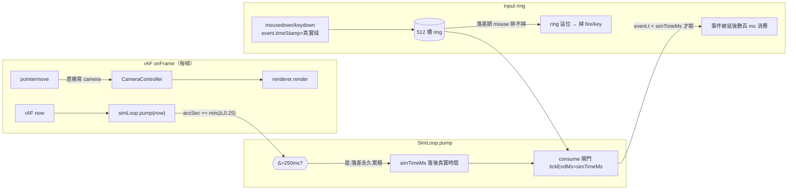

# KI-001 — 開火/鍵盤嚴重輸入延遲(sim 邏輯時鐘漂移)修改計畫

> 類型:tech spec(修改計畫)。語言:繁中,術語保留英文(D4)。
> 狀態:**Task 1+2 已實作(2026-07-09)**——re-anchor 修法落於 [SimLoop.ts:412](../../src/loop/SimLoop.ts#L412) `pump`;回歸測試 [sim-clock-drift.test.ts](../../src/loop/__tests__/sim-clock-drift.test.ts) 綠;determinism 全數(src + tests/regression)0 迴歸。Task 3/4/5 為選配硬化,尚未執行。
> 診斷來源:2026-07-08 /debug session(已用臨時 repro 測試證實,測試已移除)。

---

## 0. 症狀與證據(問題陳述)

`npm run dev` 遊戲畫面出現嚴重輸入延遲:

| # | 輸入 | 現象 |
|---|---|---|
| 1 | 滑鼠移動(視角) | **無延遲** |
| 2 | 滑鼠左鍵開火 | **很大延遲**(數百 ms),偶爾像掉輸入 |
| 3 | 鍵盤 A/D | **很大延遲** |

**已證實的量化證據**(臨時 repro 直接驅動真正的 `createSimLoop`,注入 clock):

- 無卡頓:開火事件下一幀即被消費(正常,≈1 tick)。
- **單一 700ms 卡頓後**:同樣的開火事件 **~464ms(29 幀)後才被消費**。

**現場驗證(2026-07-08,使用者確認)**:遊戲中按 drill `restart` → **延遲感立即消失**。`restart` 走 `buildSimLoop()`([main.ts:382](../../src/main.ts#L382))重建 loop、把 `simTimeMs` 重新錨定至當下真實時間、落差歸零。此結果排除其他假設(整體掉幀 / ring 設計 / 事件時間戳常數偏移皆無法解釋「restart 瞬間清掉且之後再累積」)→ **KI-001 根因定案**。

---

## 1. 需求壓縮 (Requirements)

### 1.1 Functional Requirements

- **FR-1** 系統在單次 render 卡頓(frame delta > 250ms)發生後,一旦 render cadence 回穩,對後續開火/鍵盤事件的**消費延遲必須 ≤ 2 個 sim tick(≈15.6ms)**,不得殘留數百 ms 的固定延遲。
- **FR-2** 系統必須維持既有決定性保證:**同一輸入序列在不同 render FPS 下,sim 狀態序列(tick index → position/velocity/命中)逐位一致**(ADR-3)。
- **FR-3** 系統必須維持既有 spiral-of-death 保護:**單一 frame delta > 250ms 時,該幀最多推進 `0.25s × SIM_HZ = 32` 個 tick**(不得無上限追趕)。
- **FR-4** 修法必須讓「輸入消費時鐘域」與「`event.timeStamp` 時鐘域」對齊,使 ring 不再因未排空的 mouse 事件累積而溢位(消除 `inputMeta.bufferOverflow` 次生掉輸入)。
- **FR-5** 系統必須提供可觀測指標(dev-only),外顯 sim 邏輯時鐘相對真實時鐘的落差,供回歸與現場診斷。

### 1.2 Non-functional Requirements

- **NFR-1(正確性)**:修法後,`src/loop/__tests__/determinism.test.ts` 與 `tests/regression/determinism.test.ts` **全數維持綠燈**(0 迴歸)。
- **NFR-2(延遲)**:穩態(每幀 ≤ 250ms)下,輸入事件 `event.timeStamp` 至被消費的 `tickEndMs`,落差 **≤ 1 tick(7.8125ms)**;一次 > 250ms 卡頓後的**收斂時間 = 0 幀**(下一健康幀即對齊,非 ~464ms)。
- **NFR-3(熱路徑零配置)**:`pump` 熱路徑不得新增每幀物件配置(GC 紀律,CLAUDE.md §4)。
- **NFR-4(時鐘域)**:一律 `performance.now()` / `event.timeStamp` 同源,禁 `Date.now()`(ADR-4)。

### 1.3 Constraints(硬約束,不得破壞)

- **C-1** 三迴圈只透過 `SharedState` 溝通;`simStep` 為純函式邊界(只讀寫傳入 state、不讀 `performance.now()`、不碰 DOM,OQ-2.4 Worker 搬遷相容)。
- **C-2** 決定性回歸既有斷言不可改語意,尤其:
  - `determinism.test.ts:179` — 300ms spike → **恰 32 ticks**。
  - `determinism.test.ts:184` — 含多次 >250ms spike 之序列**重播 bit-exact**。
  - `determinism.test.ts:164` — 200ms(<250,不夾)單幀 vs 多小幀切分 **bit-exact 相同**。
- **C-3** 修改僅落 `src/loop/`(sim/render 排程層);不得改 `SIM_HZ`、輸入鏈語意、命中判定、場景/顯示層。
- **C-4** 不得破壞 GD-10 顯示層工作(WP-20)已交付的四件套。

### 1.4 Open Questions

| # | 問題 | Owner | Deadline | 未解影響 |
|---|---|---|---|---|
| OQ-KI1-1 | 一次 >250ms 卡頓時,re-anchor 會「丟棄」被夾掉的模擬時間(位置在該幀一次跳進);此對研究效度是否可接受?(現行 clamp 本就丟時間,re-anchor 不新增丟棄量,只改時鐘參考) | 研究者 | 實作前 | Task 2 設計選項(A vs B) |
| OQ-KI1-2 | mouse 事件目前入同一 input ring 僅供量測/匯出(`applyInput` 忽略);是否要把 mouse 移出 sim ring(獨立量測緩衝)以根本消除 ring 壓力? | 使用者/研究者 | 可延後 | Task 5(選配硬化);不阻塞主修法 |
| OQ-KI1-3 | 是否加 WebGPU pipeline 預熱(pre-warm)以縮小首幀 stall,作為 defense-in-depth? | 使用者 | 可延後 | Task 4(選配) |

---

## 2. 系統架構與設計 (Technical Design)

### 2.1 根因(precise)

輸入分兩條路:

- **滑鼠視角**:`pointerLock.onMove → cameraController.applyDelta`([main.ts:159](../../src/main.ts#L159)),**直接寫 camera、每幀 render**,不經 sim → 不受影響(症狀 1)。
- **開火 + 鍵盤**:入 input ring,由 sim 每 tick `consume(state, tickEndMs, …)`([consume.ts:42](../../src/input/consume.ts#L42))依 `event.timeStamp < tickEndMs` 取用;`applyInput` 忽略 mouse([SimLoop.ts:57](../../src/loop/SimLoop.ts#L57))。

耦合缺陷:消費閘門 `tickEndMs = simTimeMs`,而 `simTimeMs` 由 accumulator 推進,每幀 delta 被夾:

```
// SimLoop.ts:413（pump）
accSec += Math.min((nowMs - lastMs) / 1000, 0.25);
```

當某幀卡 > 250ms:真實時間走了 Δ,`simTimeMs` 只被允許前進 250ms,**落差(Δ−250ms)永不補回**(其後 `simTimeMs` 僅以 1:1 前進)。事件戳的是真實時鐘域,於是全部落在 `simTimeMs` 的「未來」,要等邏輯時鐘慢慢爬到 → 數百 ms 延遲。

**次生效應**:落差期間該區間 mouse 事件(1000Hz+coalesced)因 `t < simTimeMs` 不成立而排不掉,堆在 512 槽 ring([types.ts:32](../../src/state/types.ts#L32));落差一大即溢位 → `pushFire`/`pushKey` 被拒收([InputSampler.ts:71](../../src/input/InputSampler.ts#L71))→ 開火/鍵盤直接掉。

**觸發源(dev 尤甚)**:WebGPU pipeline/shader 首次編譯、GLTF 場景(WP-19 預設 `fieldLow`)首幀、GC、Vite HMR、切分頁。

### 2.2 System boundary

**In scope**:
```
src/loop/SimLoop.ts        ← MODIFY pump():>250ms 夾除時 re-anchor 邏輯時鐘至真實時間  [Task 2]
src/loop/__tests__/         ← ADD 漂移回歸測試(baseline 準時 / 卡頓後不殘留延遲)      [Task 1]
src/state/SharedState.ts    ← (選配)ADD inputMeta 漂移觀測欄                            [Task 3]
src/main.ts                 ← (選配)dev-only 漂移 readout / WebGPU pre-warm             [Task 3/4]
```

**Out of scope**:
- 改 `SIM_HZ`、輸入語意、命中判定、場景/顯示層(C-3)。
- 把 sim 搬入 Worker(階段 B;本修法保持 `simStep` 純函式相容)。
- 重新設計 input ring 容量/資料結構(除非採 OQ-KI1-2)。

### 2.3 Data flow(漂移進入點)



修法核心 = 切斷 `DRIFT`:當 `Δ>250ms` 夾除時,把 `simTimeMs` 重新錨定至真實 `now`,使 `GATE` 永遠對齊 `event.timeStamp` 域。

### 2.4 Interface contracts

`pump` **簽名不變**,只改內部語意與新增不變式:

```ts
// src/loop/SimLoop.ts — SimLoop.pump
pump(nowMs: number): { ticks: number; alpha: number }
// 前置:nowMs 為量測時鐘域（performance.now()）ms。
// 後置（新增不變式 INV-ReAnchor）:
//   若 (nowMs - lastMs) > SPIRAL_CAP_S(=0.25)：
//     ① 該幀 tick 數 == SPIRAL_CAP_S * SIM_HZ（=32，維持 FR-3 / C-2）
//     ② 收尾時 simTimeMs 對齊 nowMs（logical clock 不永久落後 event 時鐘域）
//     ③ accSec 收斂為 0（alpha 重置）
//   否則（≤ 0.25s）:行為與現況 byte-for-byte 相同（C-2 三測試不受影響）。
```

參考虛擬碼(實作細節待 Task 2,不在本計畫定稿):
```
const rawDeltaS = (nowMs - lastMs) / 1000;
accSec += Math.min(rawDeltaS, SPIRAL_CAP_S);
lastMs = nowMs;
while (accSec >= tickSec) { simTimeMs += tickMs; simStep(…); accSec -= tickSec; ticks++; }
if (rawDeltaS > SPIRAL_CAP_S) {   // 夾除生效 → re-anchor,阻止永久漂移
  simTimeMs = nowMs;
  accSec = 0;
}
return { ticks, alpha: accSec / tickSec };
```

新增(選配,Task 3)觀測欄:
```ts
// SharedState.inputMeta
simClockLagMs: number;   // = 最近一次 pump 後 (nowMs - simTimeMs)；穩態應 ≈0，夾除瞬間可短暫 >0
```

### 2.5 Failure modes(對應 High-risk Task 2)

| 觸發條件 | 影響 | 處理策略 |
|---|---|---|
| re-anchor 破壞決定性(tickEndMs 於夾除幀出現跳躍,改變 recorded tick `t`) | 決定性回歸紅、研究資料不可重現 | Task 2 前先跑 baseline 決定性快照;修法後**兩支 determinism 測試逐案比對必綠**;夾除只在 >250ms 發生,三支關鍵測試(C-2)皆 ≤250ms 或只比對「重播一致」故不受影響——已於計畫階段以測試碼確認 |
| re-anchor 後 `accSec=0` 丟棄殘量,使 alpha 內插於該幀突變 | 該幀畫面位置一次跳進(hitch) | 可接受:現行 clamp 本就丟棄被夾時間;re-anchor 不新增丟棄量,僅該幀一次 hitch(見 OQ-KI1-1) |
| 選 Option B(改用真實 now 當消費閘門)導致 input 分桶脫離 tick 邊界 | 破壞 input→tick 決定性分桶 | 不採 B 作主修法;僅列為替代(§3),若採則需重寫 consume 決定性測試 |

### 2.6 Concurrency model

單執行緒單一 rAF 超級迴圈不變(ADR-2);sim 在 render callback 內 `pump`,無新增共享可變性、無 Worker/鎖。`simStep` 維持純函式(C-1),Worker 搬遷紀律不受影響。本修法**不涉入併發變更**。

---

## 3. 風險分析 (Risk Analysis)

- **決定性迴歸風險(High)**:修改核心 accumulator。緩解:修法只在 `Δ>250ms` 分支動作;C-2 三支關鍵測試已於計畫階段核對不受影響;DoD 要求兩支 determinism 測試全綠 + 修法前後對同一 pump 序列的 snapshot 逐位比對。
- **效度風險(Med)**:re-anchor 於卡頓幀丟棄被夾模擬時間 → 該幀位置跳進。緩解:與現行 clamp 語意一致(不新增丟棄);frame log(WP-20 T3)已能外顯卡頓,超地板標 `suspect`,研究端可辨識受污染 session。
- **殘留觸發風險(Med → 由 defense-in-depth 降低)**:修法消除「永久」漂移,但單次 >250ms 卡頓當幀仍有一次 hitch。緩解(選配 Task 4):WebGPU pipeline 預熱把首幀 stall 壓在 250ms 內,減少 hitch 本身頻率。
- **Technical debt(有意識妥協)**:mouse 事件續留 sim ring(僅量測用)是既有設計;本修法先不動(OQ-KI1-2),觸發重構條件 = 若修法後仍見 `bufferOverflow` 飆升,再把 mouse 移出 sim ring。

---

## 4. 任務拆解 (Task Breakdown)

> 依 CLAUDE.md §3:一 task = 一垂直切片 = 一原子 commit;先驗證再 commit。建議順序 Task 1 → 2 →(3/4/5 選配)。

| Task | Objective | Dependencies | Risk | Cplx | Definition of Done |
|------|-----------|--------------|------|------|--------------------|
| **1. 漂移回歸測試(先寫,紅燈)** | 於 `src/loop/__tests__/` 加測試:注入 clock 驅動 `createSimLoop`,(a) baseline 事件下一幀被消費;(b) 一次 >250ms 卡頓後,真實域事件於**下一健康幀** `heldFire===true`(現況會失敗) | None | Low | Low | 新測試在**未修法時紅**(重現 KI-001)、在 Task 2 後綠;斷言「卡頓後消費延遲 ≤ 2 tick」;`tsc --noEmit` 綠 |
| **2. pump re-anchor 修法** | 依 §2.4 INV-ReAnchor 改 `SimLoop.pump`:`Δ>250ms` 夾除時 `simTimeMs=nowMs; accSec=0`,保留 32-tick 上限 | Task 1 | **High** | Med | Task 1 測試轉綠;`src/loop/__tests__/determinism.test.ts` + `tests/regression/determinism.test.ts` **全綠**(含 179/184/164 三案);`npm run test:ci` exit 0;修法前後對固定 pump 序列 snapshot bit-exact(僅 >250ms 分支允許差異) |
| **3. (選配)漂移觀測欄 + dev readout** | `inputMeta.simClockLagMs` 每 pump 更新;`import.meta.env.DEV` 下於 debug overlay 顯示 | Task 2 | Low | Low | dev 畫面可見 lag readout;穩態顯示 ≈0;`inputMeta` 型別/驗證測試綠;production build 剝除(bundle 不含) |
| **4. (選配)WebGPU pipeline 預熱** | bootstrap 於首個互動前預先 render 一次目標/彈孔材質,縮小首幀 stall | Task 2 | Med | Med | 手動量測:冷啟後首次開火前的最大 frame delta 由 >250ms 降至 <250ms(frame log p-max 佐證);determinism 測試不受影響 |
| **5. (選配)mouse 移出 sim ring** | 若 OQ-KI1-2 採納:mouse 樣本改入獨立量測緩衝,sim ring 只收 key/fire | Task 2;OQ-KI1-2 | Med | Med | sim ring 不再收 mouse;匯出 mouse 樣本語意不變(export 測試綠);壓力測試下 `bufferOverflow` 恆 0 |

### 驗證總表(對應 FR)

| FR | 驗證方式 |
|---|---|
| FR-1 | Task 1 測試:>250ms 卡頓後消費延遲 ≤ 2 tick |
| FR-2 | Task 2 DoD:兩支 determinism 測試全綠 + snapshot bit-exact |
| FR-3 | C-2:`determinism.test.ts:179`(300ms→32 tick)維持綠 |
| FR-4 | Task 2 後手動壓力測試 `inputMeta.bufferOverflow` 不再飆升;(選配 Task 5 恆 0) |
| FR-5 | Task 3:`simClockLagMs` 觀測欄 + dev readout |

---

## 5. 現場快速驗證(不改 code,先確認根因)

1. **重開 drill**:`restart` 走 `buildSimLoop()`([main.ts:382](../../src/main.ts#L382))重建 loop、重新錨定 `simTimeMs` → 延遲**瞬間消失**,再於下一次大 stall 後累積。符合 = 確認 KI-001。
2. dev console 看 `window.__aimDebug.state.inputMeta`([main.ts:408](../../src/main.ts#L408)):`bufferOverflow` / `lateEventCount` 飆升 = 佐證 ring 溢位次生效應。

---

## 6. 假設(Assumptions)

- 使用者的 rAF 本身健康(滑鼠視角順證實);問題不在整體掉幀,而在 sim 邏輯時鐘漂移。
- 階段 A 鎖 Chromium 桌面版,`event.timeStamp` 與 `performance.now()` 同源(ADR-4);無跨 time-origin 常數偏移。
- 決定性測試現況全綠(修法前 baseline)。
