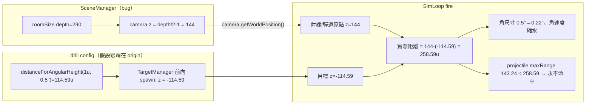

# KI-002 — br-field camera 未錨定 sim origin + protocol 場景載入驗證舊 drill(PR #34 Codex review)修改計畫

> 類型:tech spec(修改計畫)。語言:繁中,術語保留英文(D4)。
> 狀態:**🟡 D1 已落地 / D2 待落地**(2026-07-15 診斷 + 定解;Task 1(D1)已實作驗證,Task 2(D2)進行中)。
> 來源:[PR #34](https://github.com/ziy900409/FPS_aim_analyst/pull/34) Codex 自動 review 兩則(P1 / P2),已於本 repo 逐條追碼證實。
> 決策帳本:[BUGFIX-DECISIONS.md](BUGFIX-DECISIONS.md) BD-002。

本 KI 涵蓋 PR #34 review 抓出的**兩個獨立缺陷**:

| ID | 對應 review | 症狀 | 嚴重度 |
|---|---|---|---|
| **D1** | P1 | br-field 的 render camera(= 射線/彈道原點)未錨定 sim origin,BR 交戰距離被放大 ~2.3×,角尺寸/角速度自變量失效,projectile 變體永遠打不到 | **高** |
| **D2** | P2 | 從 BR drill 啟動 resolution protocol 時,`loadSceneById` 先拿**舊** BR drill 驗證 field-low 淨空 → throw,protocol 在載入正確 drill 前中止 | 中 |

---

## 0. 症狀與證據(問題陳述)

### D1 — camera 未錨定 sim origin

`SceneManager` 把 camera 放在房間一端的背牆 standoff:

```ts
// src/render/SceneManager.ts:63-65
const standoff = 1;
this.camera.position.set(0, room.eyeHeight, depth / 2 - standoff);
this.camera.lookAt(0, room.eyeHeight, -depth / 2);
```

而射線/彈道原點就是這顆 camera 的 world position(`camera.getWorldPosition(ballisticOrigin)`,[SimLoop.ts:142](../../src/loop/SimLoop.ts#L142)),BR 目標則以 **sim origin (z=0)** 為圓心、前向放在 `z = −distance`([TargetManager.ts:111](../../src/sim/TargetManager.ts#L111))。

br-field `roomSize=[42,290,8]`([br-field.ts:20](../../src/scene/scenes/br-field.ts#L20))→ camera 落在 **z=144**,前向目標在 `z=−distance`,實際交戰距離 = `144 + distance`,而非設定的 `distance`。

**量化證據**(以 `distanceForAngularHeight` 設定值代入,camera z=144):

| 條件 | 設定距離 | 實際距離 | 設定角高 → 實際角高 | projectile 可達?(`maxRangeU=143.24`) |
|---|---:|---:|---|---|
| 0.5° | 114.591u | **258.591u** | 0.5° → **0.2216°** | ❌ 143.24u 就消失 |
| 2.0° | 28.645u | **172.645u** | 2.0° → **0.3319°** | ❌ |

**後果**:
- 核心自變量(角尺寸 0.5° / 2°)全部失真 → 研究效度崩;角速度亦連帶失真(`speedForAngularRate` 以設定距離算線速度,但實際觀測距離放大 → 角速度縮水)。
- projectile `maxRangeU=143.24`([weapons.ts:92](../../src/weapon/weapons.ts#L92))剛好圍繞 `engagementDistanceU: 114.59`([weapons.ts:112](../../src/weapon/weapons.ts#L112))設計 → **4 個 projectile 變體(0.5° / 2° × ADS on/off)子彈在到達目標前就消失,永遠 0 命中**;4 個 hitscan 變體角尺寸/角速度錯誤。
- `maxRangeU`/`engagementDistanceU` 圍繞 114.59 的設計 = **原始意圖就是「玩家眼睛在 sim origin、交戰 114.59u」**;這是 render 層 camera 放置與 sim 幾何假設的座標衝突,非武器參數問題。

**為何 shipped**:唯一針對 br-field 的決定性測試 [br-tracking-invariants.test.ts:84-86](../../tests/regression/br-tracking-invariants.test.ts#L84) **自建** camera(`position.set(0,1.6,4)`),不經 `SceneManager`,故看不到真實 z=144。測試在驗「加了 GLTF 場景不擾動 sim」,**不驗實際交戰距離** → 盲區。

### D2 — protocol 場景載入驗證舊 drill

```ts
// src/main.ts:743-744（applyCondition）
await loadSceneById(condition.sceneId);   // 先換場景
await loadDrillById(condition.drillId);   // 再換 drill
```

`loadSceneById` 會把**當前(舊)** `activeDrillSource` 重新載入目標場景並驗證淨空:

```ts
// src/main.ts:720
const nextDrillConfig = loadDrill(activeDrillSource, option.config);
```

情境:使用者正在跑 BR 前向 drill(`activeDrillSource` = BR variant,前向 z=−114.59)→ 啟動 resolution protocol(首條件 = field-low + detection_popin_v1)→ `loadSceneById('field-low')` 拿舊 BR drill 驗 field-low(roomSize depth 10、backdrop props ~z=−8)→ 前向 114.59u sightline **淨空失敗 throw** → `applyCondition` reject → protocol 在 `loadDrillById('detection_popin_v1')` 前中止。

**關鍵細節(排除簡單修法)**:`detection_popin_v1` 註冊時**沒有 `sceneId`**([main.ts:100](../../src/main.ts#L100)),故 `loadDrillById` 自身不會載 field-low → 不能單純刪掉 `loadSceneById`。

---

## 1. 需求壓縮 (Requirements)

### 1.1 Functional Requirements

- **FR-1(D1)** br-field 場景中,射線/彈道原點(camera world position)必須落在 sim origin 的 z=0 平面,使前向目標的**實際交戰距離 == `DrillConfig.targets.distance`**。
- **FR-2(D1)** 修法後,8 個 `tracking_br_v1` 變體的實際角尺寸/角速度必須逐位等同其 config 宣告值(0.5° / 2°、5°/s);4 個 projectile 變體的子彈必須能抵達目標(實際距離 ≤ `maxRangeU=143.24`)。
- **FR-3(D1)** 修法必須以**顯式 scene config 欄位**表達 camera 錨點,預設值逐位等同現行 `depth/2 − standoff`;未設該欄位的場景(placeholder-room / field-low / urban-high)camera z **逐位不變**。
- **FR-4(D2)** 從任一 drill(含 BR 前向 variant)啟動任一 protocol,`applyCondition` 必須成功推進到目標 (scene, drill) 配對,**不得因驗證舊 drill 而中止**。
- **FR-5(D2)** protocol 內的場景/drill 切換必須以「驗證**最終** drill vs 最終 scene」為準,舊 drill 不得參與目標場景的淨空驗證。
- **FR-6(防回歸)** 新增一條不變性測試,斷言 `new SceneManager(brField).camera.position.z === 0`(或等價:br-field 射線原點 z===0),鎖住「radial-spawn drill 眼睛在 origin」契約,封住 D1 的測試盲區。

### 1.2 Non-functional Requirements

- **NFR-1(決定性/正確性)** 現有 `tests/regression/br-tracking-invariants.test.ts` 三案(scene 不擾動 sim / ADS gate / 彈道 gate)維持全綠;因該測試自建 z=4 camera,**不受 eyeZ 改動影響**(0 迴歸)。
- **NFR-2(逐位不變)** placeholder-room / field-low / urban-high 未設 `eyeZ` → camera 位置 byte-for-byte 不變;**WP-23 `tracking_longrange_v1` 不在本次修正範圍**(其 ~1% 側翼距離誤差為已文件化容忍值,維持現狀,見 §6 假設)。
- **NFR-3(時鐘/純度)** 不觸及 sim 狀態演進:camera z 不進 sim(目標靠 `age` 純函式演進),只改射線原點;無 `Date.now`、無 `Math.random`、無新增熱路徑配置。
- **NFR-4(硬約束)** 維持 GD-6(場景幾何不進 sim runtime)、GD-16(ADS 只落輸入/render/data)、GD-17(彈道 config-gated);本修法只動 render camera 放置與 main protocol 載入序,不改 `SIM_HZ`、命中幾何語意、彈道語意。

### 1.3 Constraints(硬約束,不得破壞)

- **C-1** `eyeZ` 為 render/scene 層設定;不得洩漏進 `src/sim`、`SharedState`、`HitDetector`、`TargetManager`(GD-6)。
- **C-2** D1 修法只改「camera 放置座標」與「一個 optional config 欄位 + validator」;不得改 sim tick、目標演進、hitbox 來源(WP-23/GD-7 單一 hitbox 來源)。
- **C-3** D2 修法只落 `src/main.ts`(protocol 載入序)+ drill 註冊表 `sceneId`;不得改 `ProtocolRunner` 契約、drill/scene 驗證器語意。
- **C-4** br-field 為原創 CC0 procedural 資產;本修法不新增/改動任何場景資產(GD-9 授權紅線)。

### 1.4 Open Questions

| # | 問題 | Owner | Deadline | 未解影響 |
|---|---|---|---|---|
| OQ-KI2-1 | `tracking_longrange_v1`(field-low,camera z=4,側翼 yaw=110°)的 ~1% 距離誤差是否需一併校正(改綁 field-low `eyeZ=0`)? | 研究者 | 可延後 | 本次**維持現狀**(使用者 2026-07-15 拍板);若日後校正需重驗 WP-23 決定性 baseline |
| OQ-KI2-2 | 補 `detection_popin_v1.sceneId='field-low'` 後,單獨從 drill 下拉選它會強制載 field-low(而非留當前場景)——確認此行為變更對現場操作可接受 | 使用者 | 實作前 | 使用者 2026-07-15 已接受;僅記錄追溯 |
| OQ-KI2-3 | E2E `tests/e2e/br-tracking.spec.ts` 修法後 projectile 變體從「0 命中」變「可命中」,是否斷言到具體命中數而需更新? | 實作者 | 實作時 | Task 2 DoD 要求重跑 playwright;若 spec 未斷言命中數則自然綠 |

---

## 2. 系統架構與設計 (Technical Design)

### 2.1 根因(precise)

- **D1**:兩套座標假設衝突。sim 的角尺寸數學(`distanceForAngularHeight` / `speedForAngularRate`)與目標 spawn(`TargetManager`)都假設**眼睛在 sim origin (0, eyeHeight, 0)**;但 `SceneManager` 的 camera 放置 `depth/2 − standoff` 是為**小佔位房間背牆站位**設計,而 br-field 為容納 114.59u 前向目標把 depth 撐到 290 → camera 被推到 z=144。GLTF 場景(`asset !== null`)會**跳過** `#buildRoom`([SceneManager.ts:54](../../src/render/SceneManager.ts#L54)),故 br-field 的 `roomSize` **只驅動 camera z**(牆不建),放大 factor 全落在射線原點上。
- **D2**:`applyCondition` 兩階段載入(scene→drill),而 `loadSceneById` 設計上會保留當前 drill 並重驗之(供場景下拉的獨立語意);protocol 場景中「當前 drill」是即將被替換的**舊** drill,不該參與目標場景淨空驗證。

### 2.2 System boundary

**In scope**:
```
src/scene/SceneConfig.ts        ← ADD proceduralRoom.eyeZ?: number + finite-number validator   [D1 / Task 1]
src/render/SceneManager.ts      ← camera.position.z 用 room.eyeZ ?? (depth/2 - standoff)          [D1 / Task 1]
src/scene/scenes/br-field.ts    ← proceduralRoom 加 eyeZ: 0                                       [D1 / Task 1]
tests/regression/…              ← ADD 不變性測試:SceneManager(brField).camera.position.z===0     [D1 / Task 1]
src/main.ts                     ← detection_popin_v1 註冊補 sceneId:'field-low';applyCondition 去掉 loadSceneById  [D2 / Task 2]
```

**Out of scope**:
- 改 sim tick / 目標演進 / hitbox 來源 / 彈道語意(GD-6/7/17)。
- 校正 `tracking_longrange_v1` 的側翼誤差(OQ-KI2-1,維持現狀)。
- 重構 `loadSceneById` / `loadDrillById` / `ProtocolRunner` 契約(D2 採最小改動 B 案,不新增合併載入器 A 案)。
- 任何場景資產變更(GD-9)。

### 2.3 Data flow(D1 距離放大進入點)



修法核心 = 令 `camera.z = 0`(`eyeZ: 0`),使射線原點與 sim origin 同點,`DIST == 設定 distance`。

### 2.4 Interface contracts

**D1** — `ProceduralRoomConfig` 新增 optional 欄位(絕對 world z,語意「眼睛在此 z」):

```ts
// src/scene/SceneConfig.ts
interface ProceduralRoomConfig {
  // …既有欄位…
  eyeZ?: number;   // 眼睛(= camera / 射線原點)world z;省略時 = depth/2 - standoff(逐位相容既有)
}
// validator:finite number（可為 0 / 負;不可 NaN/Infinity）——**不可**套 validatePositiveNumberTuple。
```

```ts
// src/render/SceneManager.ts（唯一 runtime 改動點）
const standoff = 1;
const eyeZ = room.eyeZ ?? (depth / 2 - standoff);
this.camera.position.set(0, room.eyeHeight, eyeZ);
this.camera.lookAt(0, room.eyeHeight, -depth / 2);   // 維持 -Z 基準朝向
```

`syncCameraBase()`([main.ts:616](../../src/main.ts#L616))直接讀 `camera.position.z` 當 baseZ → **自動吃到 eyeZ,無需改動**。

**D2** — 兩處:

```ts
// src/main.ts:100（drill 註冊表）
{ id: detectionPopinV1.drillId, label: detectionPopinV1.drillId, source: detectionPopinV1, sceneId: 'field-low' },
```

```ts
// src/main.ts applyCondition —— 去掉 loadSceneById,只留 loadDrillById
async applyCondition(condition) {
  activeResolutionMode = condition.mode;
  settingsPanel.setResolutionMode(condition.mode);
  settingsPanel.lockMode(true);
  resize();
  await loadDrillById(condition.drillId);   // ← 載該 drill 的正規場景 + 驗證「新」drill vs 新 scene
  return { mode: displayState.mode, sceneId: activeSceneConfig.sceneId, drillId: activeDrillConfig.drillId };
}
```

`loadDrillById(drillId)` 契約(既有,[main.ts:690](../../src/main.ts#L690)):給定帶 `sceneId` 的 drill,原子地載入其 required scene 並以 `loadDrill(新 drill source, 目標 scene)` 驗證**新** drill;`needsSceneLoad` 已處理 `activeSceneFallback` 與同場景早退。故補上 `sceneId` 後,resolution(field-low)與 BR(br-field)兩方向皆由 `loadDrillById` 一手涵蓋。`condition.sceneId` 在 `applyCondition` 內變冗餘,仍留在 protocol config;**加一條 dev assertion**:載入後 `activeSceneConfig.sceneId === condition.sceneId`,否則丟錯(封住「drill sceneId 與 condition sceneId 不一致」的靜默漂移)。

### 2.5 Failure modes

| 觸發條件 | 影響 | 處理策略 |
|---|---|---|
| eyeZ 改動意外擾動既有場景 camera | field-low/urban 命中漂移、既有 drill 迴歸 | `eyeZ` 為 optional,未設者走 `depth/2-1` 逐位不變;僅 br-field 設 0(FR-3 / NFR-2) |
| br-tracking-invariants 三案因 camera 改動變紅 | 誤判迴歸 | 該測試**自建 z=4 camera**、不經 SceneManager → 不受 eyeZ 影響;修法後仍應綠(NFR-1)。若變動即為 bug,需查是否誤改 sim 層 |
| 補 detection_popin_v1.sceneId 改動下拉獨立行為 | 選 detection_popin_v1 時強制載 field-low | 已由 OQ-KI2-2 使用者接受;dev assertion 保護 protocol 落點正確 |
| D2 移除 loadSceneById 後某 protocol drill 缺 sceneId | 場景不切、drill 落錯場景 | 加 dev assertion(§2.4)偵測落點 ≠ condition.sceneId;br/resolution 兩 protocol 的 drill 皆已帶 sceneId |
| E2E projectile 變體由 0 命中變可命中 | spec 若硬斷言命中數則變紅 | OQ-KI2-3:Task 2 重跑 playwright,必要時更新 spec 期望 |

### 2.6 Concurrency model

不涉入併發變更。單執行緒 rAF 超級迴圈(ADR-2)不變;D1 只改建構期 camera 座標,D2 沿用既有 `async` 載入序(await 串接,無新增共享可變性)。`applyCondition` 由 `ProtocolRunner` 序列驅動,單一 in-flight,無競態。

---

## 3. 風險分析 (Risk Analysis)

- **D1 效度修復影響面(Med)**:改動 br-field 命中幾何,但 br-field 為 WP-26 **新**模組、`M13/stage5 正式交付本就保留待實機手動回填**(PR #34 說明)→ 無既有研究 baseline 受污染;修法讓角尺寸/彈道**回到 config 宣告值**,是效度**修正**而非破壞。
- **D1 迴歸風險(Low)**:`eyeZ` optional + 預設逐位相容 + 唯一針對 br-field 的測試自建 camera 不受影響 → 既有測試理論 0 迴歸;仍以 DoD 全測試綠把關。
- **D2 行為變更(Low-Med)**:補 `sceneId` 改下拉獨立語意(OQ-KI2-2 已接受);移除 loadSceneById 後靠 `loadDrillById` + dev assertion 保證落點。風險集中在「是否所有 protocol drill 都帶 sceneId」——目前 br/resolution 皆帶,assertion 兜底。
- **測試盲區(本次封閉)**:D1 之所以 shipped 是因 invariants 測試自建 camera。FR-6 新增「真實 SceneManager camera z===0」不變性測試,將此盲區轉為回歸網。
- **有意識妥協**:`tracking_longrange_v1` 的 ~1% 側翼誤差不在本次修正(OQ-KI2-1 維持現狀);觸發重做條件 = 研究者判定該誤差不可接受時,另開 task 綁 field-low `eyeZ=0` 並重驗 WP-23 決定性。

---

## 4. 任務拆解 (Task Breakdown)

> 依 CLAUDE.md §3:一 task = 一垂直切片 = 一原子 commit;先驗證再 commit。D1、D2 相互獨立,順序不拘;建議 Task 1(D1)→ Task 2(D2)。

| Task | Objective | Deps | Risk | Cplx | Definition of Done |
|------|-----------|------|------|------|--------------------|
| **1. D1 — eyeZ 錨點 + 不變性測試** ✅ | `SceneConfig` 加 `eyeZ?` + finite-number validator;`SceneManager` 用 `room.eyeZ ?? (depth/2-standoff)`;br-field 設 `eyeZ:0`;新增測試斷言 `new SceneManager(brField).camera.position.z===0` 且 placeholder/field-low/urban camera z 逐位不變 | None | Med | Low | 新不變性測試綠;`tsc --noEmit` 0;`br-tracking-invariants` 三案維持綠;數值驗證:0.5° 變體實際交戰距離 == 114.591u(誤差 < 1e-3)、projectile 實際距離 ≤ 143.24 → 可命中;`npm run test:ci` exit 0 |
| **2. D2 — protocol 原子載入(補 sceneId)** | drill 註冊表補 `detection_popin_v1.sceneId='field-low'`;`applyCondition` 移除 `loadSceneById(condition.sceneId)`,只留 `loadDrillById(condition.drillId)`;加 dev assertion 落點 == condition.sceneId | None | Med | Low | 回歸測試:BR drill 為 active 時啟動 resolution protocol,首條件成功載 field-low+detection_popin_v1、不 throw;`ProtocolRunner` 既有測試綠;`tests/e2e/br-tracking.spec.ts` + resolution protocol e2e 全綠(必要時更新 OQ-KI2-3 命中期望);`npm run test:ci` exit 0 |

### 驗證總表(對應 FR)

| FR | 驗證方式 |
|---|---|
| FR-1 / FR-2 | Task 1 數值斷言:br-field 實際交戰距離 == config distance、projectile 實際距離 ≤ maxRangeU |
| FR-3 | Task 1:placeholder/field-low/urban camera z 逐位不變測試 |
| FR-4 / FR-5 | Task 2 回歸測試:BR-active → 啟動 protocol 不中止、落點正確 |
| FR-6 | Task 1:`SceneManager(brField).camera.position.z===0` 不變性測試 |

---

## 5. 現場快速驗證(不改 code,先確認根因)

1. **D1**:dev 跑 `tracking_br_v1`(ADS projectile 0.5°),對準前向目標連續開火 → **無論如何 0 命中**(子彈 143.24u 消失,目標在 258.59u);切到 hitscan 變體則能命中但目標**看起來遠比 0.5° 小**。符合 = 確認 D1。
2. **D2**:先載任一 BR 前向 drill,再從 UI 啟動 resolution/detection protocol → **protocol 立即中止 / console 報 field-low 淨空驗證失敗**。符合 = 確認 D2。

---

## 6. 假設 (Assumptions)

- 階段 A 鎖 Chromium 桌面版;camera/射線/目標同一 world 座標空間(Three.js),射線原點取 camera world position 為既定設計。
- BR 目標為前向 radial spawn(yaw=0 → z=−distance),故「眼睛在 origin」是其角尺寸/彈道正確性的前提;側翼 spawn(longrange yaw=110°)對 camera z 偏移不敏感,故其 ~1% 誤差維持現狀(OQ-KI2-1)。
- br/resolution 兩 protocol 的每個 condition drill 都能宣告唯一正規 `sceneId`(D2 B 案前提);dev assertion 兜底偵測違反。
- WP-26 stage5 正式交付本就保留待實機手動回填(PR #34),故 D1 幾何修正不影響任何已交付研究資料。
