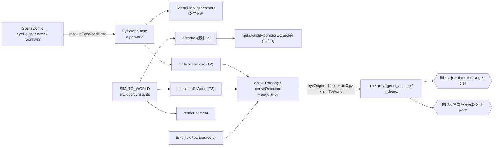

# KI-004 / S1 — 修正性落地(tech spec)

> **範圍**:[KI-004](../KI-004-sim-world-unit-domain-mismatch.md) §5.1 的 **S1 修正性**階段,**外加 2026-08-05 使用者拍板前拉的 S2 ②③ + ① 靜態部分**(`meta.simToWorld` / `meta.scene.eye` / `meta.validity`;見 §5 OQ-S1-1、OQ-S1-2 的關閉紀錄)。診斷與修法拍板(K-1/K-2/K-3)為上游權威,本檔**不重述診斷**,只定義「S1 要改什麼、介面長什麼樣、怎麼證明修對了」。
> **決策帳本**:[BUGFIX-DECISIONS.md](../BUGFIX-DECISIONS.md) BD-004 · **協議**:[CLAUDE.md §3](../../../CLAUDE.md) · **術語**:[CONTEXT.md](../../../CONTEXT.md)
> **狀態**:⬜ 計畫已定,尚未動任何程式碼。
> 語言:繁體中文,技術術語保留英文(D4)。

---

## 0. 一句話

把 `SIM_TO_WORLD` 從 `main.ts` 的 render-only 佔位常數升為**引擎級單位域橋樑**,讓 corridor gate 與離線 ε(t) 推導都在 **world domain** 做幾何比較;**讓匯出自我描述量測原點**(`meta.simToWorld` + `meta.scene.eye`),使離線分析者不必再靠「約定」猜;同時補上專案目前**完全缺席的正確性閘**(`fire.offsetDeg` oracle),使「TS 與 Python 一起錯」這一類缺陷在 CI 就被抓到。

---

## 1. 需求壓縮 (Requirements)

### 1.1 Functional Requirements

| # | 需求 | 來源 |
|---|---|---|
| **FR-S1-1** | 系統必須提供**唯一**的 source unit → world unit 換算常數 `SIM_TO_WORLD`,置於引擎級模組(`src/loop/constants.ts`),`main.ts` 與所有消費者一律 import 該常數,repo 內不得存在第二份字面值 `0.01` 作為單位換算用途。 | KI-004 §5.1 S1 ① |
| **FR-S1-2** | 系統必須提供**唯一**的「eye world base 解析函式」,由 `SceneConfig` 決定性推導出 `(x, y, z)`(world),`SceneManager` 的 camera 初始位置必須改由該函式產出,且對現行四個場景**逐位不變**。 | KI-004 §2.3(三片段分散)· KI-002/D1 |
| **FR-S1-3** | corridor 觀測必須在 world domain 比較:`|player.x| × SIM_TO_WORLD > playerCorridor.halfWidthU`。 | KI-004 §2.2 · D1-A |
| **FR-S1-4** | corridor 越界**不得**單獨觸發 `meta.suspect`(K-3);`state.validity.playerCorridorExceeded` 保留為純觀測旗標。 | KI-004 K-3 |
| **FR-S1-5** | `trackingDerivation` / `detectionDerivation` 必須以「eye world pose = `base + (px, 0, pz) × simToWorld`」為射線原點,不得再寫死 `(px, eyeY, pz)`。 | KI-004 §1.2 / §2.3.1 |
| **FR-S1-6** | 兩個 derivation 必須在回傳結果中**具名揭露**所使用的 eye origin 與其來源(`explicit` / `meta` / `legacy-default`),使「原點是猜的」在資料上可見而非隱形。 | KI-004 §2.3 結構性根因 |
| **FR-S1-7** | 兩個 derivation 必須支援 `strictEyeOrigin` 模式:落到 `legacy-default` 時拋錯而非靜默推導。研究側入口(parity generator / `run_pipeline`)一律走 strict。 | 本檔 §2.5(防止 D2a 復發) |
| **FR-S1-8** | Python 側 `angular.py` 的 `epsilon_deg` / `on_target` 必須接受同一組 eye origin 契約,語意與 TS 逐位一致(C-D4)。 | KI-004 §5.1 S1 ④ |
| **FR-S1-9** | 系統必須新增**正確性閘 ①**:對任一含 `fire.offsetDeg` 的匯出,ε(t) 在該 fire 所屬 tick 的值與 `offsetDeg` 的差必須 ≤ 容差(僅對 `aimPunchPitch == 0 && aimPunchYaw == 0` 的 fire 成立)。 | KI-004 §6 閘 ① |
| **FR-S1-10** | 系統必須新增**正確性閘 ②**:合成幾何 fixture 必須涵蓋 `eyeBase.z ≠ 0` **且** `px ≠ 0` 的交叉情境,期望值以閉式解給定。TS 與 Python 兩側各一份。 | KI-004 §6 閘 ② |
| **FR-S1-11** | 必須重產 `research/fixtures/parity/epsilon-synthetic_counterstrafe.json`,且重產後 `tests/golden/research/epsilon-parity.test.ts` 綠。 | KI-004 §6.3 |
| **FR-S1-12** | 必須完成 M14 ② 的重新宣告與跨文件對帳(含 [exec-plan/README.md](../../exec-plan/README.md) §3 M14 列、[MAP.md](../../MAP.md)、[WP-28 progress.md](../../exec-plan/active/stage4/wp-28-research-foundation/progress.md)),並解除 WP-30/31 的 entry blocker。 | KI-004 §3 · K-2 |
| **FR-S1-13** | 匯出必須記錄 `meta.simToWorld`(world unit per source unit),使離線消費者能還原單位域換算。 | OQ-S1-1 前拉(原 S2 ②) |
| **FR-S1-14** | 匯出必須記錄該 run 的 **eye world base** `meta.scene.eye = {x,y,z}`;該值必須在 **data 層**由 `resolveEyeWorldBase(sceneConfig)` 決定性算出,**不得**從 render camera 讀取。 | OQ-S1-1 前拉(原 S2 ① 的靜態部分) |
| **FR-S1-15** | 匯出必須記錄 `meta.validity = { corridorExceeded, perfFloor, recorderOverflow, bufferOverflow }`;`meta.suspect` 保留為向後相容的 OR 旗標,且其 OR 集合在 S1 **只減不加**(移除 corridor,其餘不動)。 | OQ-S1-2 前拉(原 S2 ③)· K-3 |

### 1.2 Non-functional Requirements

| # | 需求 | 量化指標 |
|---|---|---|
| **NFR-S1-1** | sim 決定性零影響 | S1 **不得**改動 `src/sim/`、`SharedState` 的演進邏輯、`SimLoop.step` 的狀態轉移。既有決定性回歸(WP-2 C-2 三案 + 場景/ADS/彈道 gate)必須**逐位**維持,`git diff` 不觸及上述路徑 |
| **NFR-S1-2** | 匯出 schema **只增不改** | 新增欄位一律 **optional additive**(`meta.simToWorld` / `meta.scene.eye` / `meta.validity`);**不刪除、不改名、不改變任何既有欄位的尺度或語意**;`schemaVersion` 維持 `2`;舊匯出缺欄 → 消費端 fallback 並標記來源。`ticks[]` / `events[]` 逐欄不動 |
| **NFR-S1-2b** | `meta.suspect` 的變更可逐條追溯 | S1 對 `suspect` 的唯一改動 = **移除** `playerCorridorExceeded`(K-3);其餘 OR 項(session/protocol suspect、`perfFloor`、`recorderOverflow`)逐位不變,且 `bufferOverflow` **不得**被併入。以測試釘死 |
| **NFR-S1-3** | render 逐位不變 | 四個場景的 camera 初始 world 位置與每幀位置在 S1 前後逐位相同(FR-S1-2 為純重構) |
| **NFR-S1-4** | 閘 ① 容差 | `|ε(tick_at_fire) − fire.offsetDeg| ≤ 0.5°`(實測殘差 0.1–0.2°,取 ~2.5× 邊際涵蓋 tick 取樣 + sub-tick 內插);修法**前**必須在 08:03 fixture 上為紅(實測 12.52°) |
| **NFR-S1-5** | 閘 ② 精度 | 閉式解與實作差 ≤ `1e-9`(相對),與既有 parity 閘同量級 |
| **NFR-S1-6** | 回歸零紅 | `npx tsc --noEmit` exit 0 · `npm run test:ci` exit 0 · `uv run pytest` exit 0 |

### 1.3 Constraints(不可違反)

- **C-1** — GD-6:場景幾何永不進 sim runtime。`src/sim`、`SharedState`、`HitDetector`、`TargetManager` **不得**引用場景資料。S1 的 eye base 解析落在 `src/scene`(render/驗證層)與 `src/metrics`(離線推導層),兩者皆不在禁引用清單內。
- **C-2** — `SIM_TO_WORLD` **不掛 `SceneConfig`**(KI-004 §5.1 明文):掛上去會讓同一 drill 在不同場景產生不同幾何,且讓行為依賴場景資料,踩 GD-6 精神。
- **C-3** — C-D1:`research/` 只讀匯出 JSON/CSV 與 golden fixture,不得 import 任何 TS 模組;`src/` 不得 import Python 產物(例外 = committed parity fixture)。
- **C-4** — C-D4:ε(t)/on-target 為既有構念,**TS + `docs/operational/analysis-*.md` 為權威**,Python 對表。S1 改變構念的原點定義 ⇒ **必須同時**改 TS 實作與該 prose spec 的原點段落,否則權威分裂。
- **C-5** — WP-23/GD-7:`hitbox` 預設省略時逐位等同 H1 `{1,2,1}`;命中判定與 on-target 推導共用同一 AABB 來源。S1 不得新增第二套尺寸常數。
- **C-6** — BD-001 的 TDD 偏離慣例:紅測試先在工作區證實為**紅**,再修法轉綠,紅+綠**合併為單一已驗證 commit**(repo 硬規「每個 commit 綠」)。

### 1.4 In scope / Out of scope

**In scope**

- `src/loop/constants.ts`(新增 `SIM_TO_WORLD`)
- `src/scene/`(新增 eye world base 解析純函式;`SceneManager` 改為消費它;corridor 判定純函式)
- `src/data/metadata.ts` · `src/data/export.ts`(**前拉**:`meta.simToWorld` / `meta.scene.eye` / `meta.validity` 三個 additive 區塊)
- `src/main.ts`(corridor gate world 域比較 + 從 `suspect` 拆除 + import 常數 + 填入新 meta)
- `src/metrics/trackingDerivation.ts` · `src/metrics/detectionDerivation.ts` · `src/metrics/eyeOrigin.ts`(新)
- `src/testharness/fpsTestHarness.ts`(傳入真實 eye base)
- `research/src/modules/kinematics/algorithms/angular.py` + 其呼叫端(`run_pipeline.py`、parity generator)
- `research/fixtures/exports/synthetic_counterstrafe.json`(補新 meta)· `research/fixtures/parity/epsilon-synthetic_counterstrafe.json`(重產)
- 新增測試:閘 ①、閘 ②、corridor 邊界、camera 逐位不變、新 meta 欄位驗證、`suspect` 逐位不變
- `docs/operational/schema.md`(新欄位)· `analysis-tracking.md` / `analysis-t-detect.md` 的**射線原點定義段落**(C-4 要求的同步)
- 帳本/里程碑對帳:KI-004 狀態、BD-004 狀態、M14 ② 重新宣告、exec-plan README / MAP.md

**Out of scope**(明確排除,防範圍蔓延)

| 排除項 | 歸屬 |
|---|---|
| **逐 tick** eye world pose 欄位(與 `aim` 並列的 raw 儀器姿態) | **S2** —— 靜態 base 已足以還原原點(場景在 drill 內固定);逐 tick 版是 GD-7 raw-over-derived 的完整形式,非還原所需 |
| `CONTEXT.md` 正規單位一節改寫、`schema.md` **既有欄位**的單位敘述對帳、`SimU`/`WorldU` branded type | **S3**(文件/ADR) |
| corridor 觀測項的**記錄粒度**(`max|lateral|`(world u)/ 越界 tick 佔比) | **OQ-KI4-2**。S1 只落布林 `corridorExceeded`;粒度升級待研究者定 |
| `clearance.halfWidthU` 是否拆成兩個欄位 | **OQ-KI4-6**,見本檔 §5(建議不拆) |
| 任何 sim 演進 / hitbox / 彈道 / 命中語意改動 | 不做(NFR-S1-1、C-5) |
| 把 `bufferOverflow` 併入 `meta.suspect` | 不做(NFR-S1-2b;未經授權的語意擴大) |
| WP-30 / WP-31 的指標實作 | 待 M14 ② 重新宣告後另行展開 |

---

## 2. 技術設計 (Technical Design)

### 2.1 System boundary

```
                       ┌──────────────────────────────────────┐
  sim domain (u)  ───► │  SIM_TO_WORLD  (src/loop/constants)  │ ───► world domain (m)
   player.x/z          └──────────────────────────────────────┘        幾何/hitbox/camera
   vx / vStrafe                        ▲
   CS2_PROFILE                         │ 唯一橋樑(FR-S1-1)
                                       │
        ┌───────────────┬──────────────┴──────────────┬───────────────┐
        │               │                             │               │
  ① render camera  ② corridor 觀測          ③ 離線 ε(t) 原點    ④ 匯出 meta
  (已正確)         (main.ts,T3 修)      (metrics+angular.py,T4/T5)  (T2 新增)
```

S1 的工作 = 把 ② ③ 接上同一座橋,並經由 ④ 讓**匯出自我描述**該座橋與 eye world base —— ③ 因而不再需要「猜」。

### 2.2 Data flow — 射線原點的三個片段如何合流



**前拉後的關鍵改變**:`EyeWorldBase` 與 `simToWorld` 進入匯出(T2)⇒ `resolveEyeOrigin` 的 `'meta'` 分支**實際生效**,離線消費者不必再由呼叫端顯式傳入。`legacy-default` 從「常態路徑」降為「只有 pre-S1 匯出才會踩到的相容路徑」——兩份真實 fixture(08:03 / 09:39)刻意保留不補欄,正是為了讓該路徑持續受測。

### 2.3a 匯出新增的三個 additive 區塊(T2)

```ts
// src/data/metadata.ts —— 全部 optional additive;schemaVersion 維持 2
export interface Meta {
  /* ...既有欄位逐條不動... */

  /** world unit per source unit —— 單位域橋樑(FR-S1-13)。缺席 = pre-S1 匯出。 */
  simToWorld?: number;

  /**
   * runtime validity 觀測拆解(FR-S1-15)。與 `suspect` **不是同一集合**:
   * `suspect` 依 K-3 已不含 `corridorExceeded`,且從不含 `bufferOverflow`。
   */
  validity?: {
    corridorExceeded: boolean;   // 走廊觀測(K-3:純觀測,不作廢 run)
    perfFloor: boolean;          // frames.summary.p95 > PERF_FLOOR_MS
    recorderOverflow: boolean;
    bufferOverflow: boolean;     // 觀測用;**不**進 suspect
  };
}

export interface SceneMeta {
  /* ...既有欄位不動... */
  /**
   * 射線/彈道原點的 world base(FR-S1-14)。三分量皆 finite,**允許 0 與負值**
   * (br-field 的 eyeZ = 0,KI-002/D1)。
   * 由 data 層以 `resolveEyeWorldBase(sceneConfig)` 決定性算出 ——
   * **不得**從 render camera 讀(camera 位置經 alpha 內插,會讓匯出依賴
   * render 幀率,破壞決定性並違反 ADR-2;KI-004 §5.1 實作坑)。
   */
  eye?: { x: number; y: number; z: number };
}
```

**`meta` 分支的解析規則**(T4 的 `resolveEyeOrigin` / T5 的 `resolve_eye_origin` 共用):

```
meta 分支成立 ⇔ meta.simToWorld 為正有限數 **且** meta.scene?.eye 三分量皆有限
只拿到一半 → 視為 miss,退 legacy-default(不得半猜半讀)
```

### 2.3 Interface contracts — TypeScript

```ts
// src/loop/constants.ts —— 新增(FR-S1-1)
/**
 * world unit per source unit —— sim domain(Source unit)與 world domain(three.js,≈公尺)
 * 之間的唯一橋樑(KI-004 / K-1「雙域 + 顯式換算」)。
 * 幾何(位置/hitbox/eyeHeight/場景/camera)= world;kinematics(vx/vStrafe/CS2_PROFILE)= source unit。
 * **不掛 SceneConfig**:同一 drill 不得因場景不同而產生不同幾何(KI-004 §5.1 / GD-6 精神)。
 */
export const SIM_TO_WORLD = 0.01;
```

```ts
// src/scene/eyePose.ts —— 新增(FR-S1-2)
export interface EyeWorldBase {
  /** world x — 玩家 sim 原點對應的 camera x(現行全場景皆 0)。 */
  x: number;
  /** world y — camera 高度,= proceduralRoom.eyeHeight。 */
  y: number;
  /** world z — KI-002/D1 的 eyeZ ?? depth/2 − CAMERA_STANDOFF。 */
  z: number;
}

/** camera 與背牆的保留距離(world unit);原為 SceneManager 內的 local `standoff`。 */
export const CAMERA_STANDOFF = 1;

/**
 * 由 SceneConfig 決定性推導射線/彈道原點的 world base。
 * 純函式、無副作用、不讀時鐘;`SceneManager` 與離線推導共用此唯一定義。
 * @throws 當 proceduralRoom 缺欄或含非有限數值(沿用 SceneConfig validator 的錯誤語意)。
 */
export function resolveEyeWorldBase(config: SceneConfig): EyeWorldBase;
```

```ts
// src/metrics/eyeOrigin.ts —— 新增(FR-S1-5/6/7),供 tracking + detection 兩個 derivation 共用
export interface EyeOriginOptions {
  /** 顯式 eye world base;優先級最高。 */
  eyeBase?: EyeWorldBase;
  /** world unit per source unit;省略時取 SIM_TO_WORLD。 */
  simToWorld?: number;
  /** @deprecated 相容別名 —— 等價於 `eyeBase.y`,僅在未給 `eyeBase` 時生效。 */
  eyeHeight?: number;
  /** true 時,解析落到 `legacy-default` 即拋錯(研究側入口必開)。 */
  strictEyeOrigin?: boolean;
}

export type EyeOriginSource = 'explicit' | 'meta' | 'legacy-default';

export interface ResolvedEyeOrigin {
  base: EyeWorldBase;
  simToWorld: number;
  /** 揭露原點從哪來 —— 'legacy-default' 表示 base.z 是猜的(D2a 的復發面)。 */
  source: EyeOriginSource;
}

/**
 * 解析優先序:
 *   1. `options.eyeBase`(+ `options.simToWorld`)                    → source = 'explicit'
 *   2. `meta.scene.eye` + `meta.simToWorld`(T2 起的 S1 匯出皆有)    → source = 'meta'
 *      —— 兩者**都**要有效才成立;只拿到一半視為 miss(不得半猜半讀)
 *   3. legacy fallback `{ x: 0, y: eyeHeight ?? 1.6, z: 0 }` + `SIM_TO_WORLD`
 *                                                                    → source = 'legacy-default'
 * 注意:fallback **仍套用 SIM_TO_WORLD**(D2b 的因子是全域引擎常數,可知)。
 * 只有 `base.z`(D2a)無法從 pre-S1 匯出還原 —— 故以 source 旗標 + strict 模式讓它可見/可擋。
 * @throws `strictEyeOrigin === true` 且解析落到 'legacy-default'。
 */
export function resolveEyeOrigin(
  payload: ExportPayload,
  options?: EyeOriginOptions,
): ResolvedEyeOrigin;

/** eyeOrigin(tick) = base + (px, 0, pz) × simToWorld。純函式,逐 tick 呼叫。 */
export function eyeOriginForTick(
  tick: { px: number; pz: number },
  resolved: ResolvedEyeOrigin,
): { x: number; y: number; z: number };
```

兩個 derivation 的公開型別擴充(**additive**,既有欄位不動):

```ts
// trackingDerivation.ts
export interface TrackingDerivationOptions extends EyeOriginOptions {
  hitbox?: HitboxSize;               // 不變
}
export interface ResolvedTrackingDerivationOptions {
  eyeHeight: number;                  // 保留(= eyeOrigin.base.y),避免既有斷言全面重寫
  hitbox: HitboxSize;                 // 不變
  eyeOrigin: ResolvedEyeOrigin;       // 新增(FR-S1-6)
}

// detectionDerivation.ts —— 同型擴充
export interface DetectionDerivationOptions extends EyeOriginOptions { /* 既有欄位不變 */ }
export interface ResolvedDetectionDerivationOptions {
  /* 既有欄位不變 */
  eyeOrigin: ResolvedEyeOrigin;       // 新增
}
```

`isOnTarget` 與 `angularEccentricityDeg` 的簽名由 `(tick, target, eyeHeight)` 改為 `(tick, target, resolvedEyeOrigin, ...)`,兩檔**共用** `eyeOrigin.ts`(消除目前 `angularEccentricityDeg` 在兩檔各有一份的複製,見 KI-004 §2.3.1)。

### 2.4 Interface contracts — Python(C-D4 對表面)

```python
# research/src/modules/kinematics/algorithms/angular.py
@dataclass(frozen=True)
class EyeOrigin:
    base: tuple[float, float, float]   # world (x, y, z)
    sim_to_world: float                # world unit per source unit
    source: Literal["explicit", "meta", "legacy-default"]

def resolve_eye_origin(
    meta: Mapping[str, Any],
    *,
    eye_base: Sequence[float] | None = None,
    sim_to_world: float | None = None,
    eye_height: float | None = None,     # deprecated 別名 → base.y
    strict: bool = False,
) -> EyeOrigin: ...
    # 與 TS `resolveEyeOrigin` 逐條同構(優先序、fallback、strict 拋錯)
    # strict 時落到 legacy-default → raise ValueError

def epsilon_deg(
    ticks: pd.DataFrame,
    meta: Mapping[str, Any],
    *,
    eye_origin: EyeOrigin,
    fallback_target: Sequence[float] | None = None,
) -> np.ndarray: ...

def on_target(
    ticks: pd.DataFrame,
    meta: Mapping[str, Any],
    *,
    eye_origin: EyeOrigin,
    fallback_target: Sequence[float] | None = None,
) -> np.ndarray: ...
```

- **簽名破壞性變更**:現行第三位置參數 `eye_height: float = 1.6` 改為 keyword-only 的 `eye_origin`。呼叫端共 3 處:`run_pipeline.py:305`、`notebooks/t2/generate_epsilon_parity.py`、`algorithms/tests/test_angular.py`。刻意**不留位置參數相容**——留著就等於留著「靜默用錯原點」的入口(§3.2)。
- `_geometry()` 的 `origins = np.column_stack((px, eye_height, pz))` 改為 `base + column_stack((px, 0, pz)) * sim_to_world`。
- C-D1 維持:Python 不 import 任何 TS;`SIM_TO_WORLD` 的 Python 端常數以 module 常數 `SIM_TO_WORLD = 0.01` 落在 `angular.py`,並由**閘 ②** 的雙側閉式解 fixture 綁死兩側同值(不是靠人工同步)。

### 2.5 正確性閘的契約(S1 的核心交付)

> **架構層前提**(BD-004 已入帳):parity 是**一致性閘**(A == B),設計上不可能發現 A 與 B 一起錯。S1 補的是**正確性閘**。

**閘 ① — `fire.offsetDeg` oracle**(免費、最高優先)

```
輸入:任一 ExportPayload(含 events[].type === 'fire')
篩選:F.offsetDeg !== undefined
     && (F.aimPunchPitch ?? 0) === 0 && (F.aimPunchYaw ?? 0) === 0   ← offsetDeg 含視覺 punch
選 tick:T = argmin_t |tick.t − F.t|
斷言:|ε(T, target(F.targetId)) − F.offsetDeg| ≤ 0.5°
覆蓋:兩份真實 fixture(08:03 / 09:39)各自的合格 fire 全數
```

- **修法前必須紅**:08:03 fixture 上實測偏差中位數 12.52°(D2a 單獨作用)、09:39 上 67.11°(D2a+D2b)。
- **修法後必須綠**:實測 `ε_正確` 殘差 0.21° / 0.14°(來源 = fire 時間戳 vs 最近 tick 的取樣差,非系統性偏差)。
- 若合格 fire 樣本數為 0,測試必須**失敗**(防止篩選條件寫死導致空跑假綠)。

**閘 ② — `eyeBase.z ≠ 0` 且 `px ≠ 0` 的閉式幾何 fixture**

```
構造:eyeBase = (0, 1.6, 4)、simToWorld = 0.01、px = 169.25(取自 09:39 的 max|px|)
     target = (2, 1.5, −4)、aim = 已知 yaw/pitch
期望:ε_expected 由閉式解手算(向量夾角),以常數寫死於測試
斷言:|ε_actual − ε_expected| / |ε_expected| ≤ 1e-9   (TS 與 Python 各一份)
```

現行 WP-28 T2 幾何 fixture 全為原點 `(0,·,0)` 的靜態情境,**結構上看不見這個 bug**;閘 ② 封住該盲區。

### 2.6 Failure modes

| # | 觸發條件 | 影響 | 處理策略 |
|---|---|---|---|
| **FM-1** | 消費 **pre-S1 匯出**(如 08:03 / 09:39)且呼叫端未顯式提供 eye base | ε 的 `base.z` 退回 0 → D2a 復發(12.5° 量級) | `source: 'legacy-default'` 具名揭露 + `strictEyeOrigin` 在研究側入口拋錯(FR-S1-7);閘 ① 以顯式 base 覆蓋兩份真實 fixture。**T2 前拉後,新匯出不再走此路徑** |
| **FM-1b** | `meta.scene` 缺席(該區塊本身 optional)或只有 `simToWorld` 有值 | 半猜半讀 → 比全猜更難察覺 | 解析規則明訂「兩者都有效才算 `'meta'`」(§2.3a);單元測試覆蓋「只有一半」的案子 |
| **FM-1c** | eye base 誤從 `sceneManager.camera.position` 讀入 meta | camera 位置經 `alpha` 內插 ⇒ 匯出依賴 render 幀率,**破壞決定性 + 違反 ADR-2** | T2 的 DoD 以 `git diff` 明文複查;eye base 一律走 `resolveEyeWorldBase(sceneConfig)` 純函式 |
| **FM-2** | 修法後 `deriveTrackingMetrics` 的既有期望值變動(harness e2e round-trip、`trackingDerivation.test.ts`) | 綠測試轉紅,可能被誤判為迴歸 | **每一條變動的期望值必須逐條書面歸因**為「舊值本來就錯」,並記入 `progress.md`;不得為了讓測試綠而回頭放寬容差 |
| **FM-3** | Python 端 `SIM_TO_WORLD` 與 TS 端漂移 | 兩側再度「一致地錯」的變體 | 閘 ② 以**閉式解**(而非互相對表)在兩側各斷言一次;數值不同即紅 |
| **FM-4** | `resolveEyeWorldBase` 重構意外改動 camera 初始位置 | render 行為變更、既有 e2e/決定性 fixture 全面偏移 | T1 以四場景 camera 位置的逐位斷言測試先行(RED 不成立則以既有值封裝為 golden) |
| **FM-5** | corridor 從 `suspect` 拆除後越界資訊遺失 | pilot 期間的越界事實無從追溯 | **已消除**:`meta.validity.corridorExceeded` 隨 OQ-S1-2 前拉進 T2。殘餘限制 = 只有布林、無粒度(OQ-KI4-2) |
| **FM-5b** | `meta.validity` 上線時順手把 `bufferOverflow` 併進 `suspect` | 未經授權地擴大 `suspect`,舊資料判讀口徑被改 | NFR-S1-2b + T2 的「`suspect` 逐位不變」測試釘死 |
| **FM-6** | 重產 parity fixture 時誤用舊 generator 參數 | parity 綠但對到錯的原點 | generator 一律 `strict=True`,且 parity fixture 的 `options` 必須含 `eyeOrigin`,由 `epsilon-parity.test.ts` 逐欄比對 |

### 2.7 Concurrency model

**不適用**。S1 全部落在純函式(離線推導、常數解析)與既有 `afterTick` 回呼(單執行緒、sim loop 內、無新共享狀態)。三迴圈邊界(ADR-2)不變:S1 不新增任何跨迴圈通訊,不從 render camera 讀值進 sim 或 data 層(該坑屬 S2,見 KI-004 §5.1 註)。

---

## 3. 風險分析 (Risk Analysis)

### 3.1 風險登錄

| # | 風險 | 等級 | 說明 / 緩解 |
|---|---|---|---|
| **R-1** | 既有綠測試因「修正錯值」而轉紅,規模未知 | **High** | 受影響面:`trackingDerivation.test.ts`、`detectionDerivation.test.ts`、`tests/e2e/br-tracking.spec.ts`(WP-23 M11 round-trip)、`epsilon-parity.test.ts`、Python `test_angular.py`。**T0 必須先量測**受影響測試清單與偏差量級,不得邊修邊發現。處理見 FM-2 |
| **R-2** | ~~「原點靠猜」在 S1 結束後仍存在~~ | ~~High~~ → **已消除** | OQ-S1-1 前拉後,匯出自我描述原點與換算(T2)。殘餘:pre-S1 匯出仍需顯式 base(FM-1),由 `source` 旗標 + strict 覆蓋 |
| **R-2b** | 前拉使 S1 動到 `metadata.ts` / `export.ts` 這兩個**所有匯出都會經過**的檔 | Med | 三個區塊全 optional additive,`schemaVersion` 不動;以 NFR-S1-2b 的「`suspect` 逐位不變」測試 + `metadata.test.ts` / `export.test.ts` 的 validator 拒絕案封住。若 golden/決定性 fixture 因新欄位而 diff ⇒ 代表寫入路徑不決定性,立即停 |
| **R-3** | `resolveEyeWorldBase` 重構動到 render 熱路徑 | Med | 純建構期呼叫(`SceneManager` constructor),非逐幀;以 FM-4 的逐位斷言封住 |
| **R-4** | Python 簽名破壞影響 notebook / 既有分析腳本 | Med | 呼叫端僅 3 處且全在 repo 內;`uv run pytest` 覆蓋。刻意不留相容位置參數(§2.4) |
| **R-5** | 閘 ① 的容差選得太鬆,漏掉未來的中等偏差 | Med | 0.5° vs 實測殘差 0.14–0.21°(~2.5× 邊際)、vs 待抓偏差 12.5°(25×)。訊噪比充分;若 S2 落地後殘差降到 sub-tick 內插等級,可再收緊 |
| **R-6** | ~~corridor 觀測無匯出落點~~ | ~~Med~~ → **已消除** | OQ-S1-2 前拉(T2 的 `meta.validity`)。殘餘 = 粒度僅布林(OQ-KI4-2) |
| **R-7** | M14 ② 重新宣告時證據不足(仍只有單一 counter-strafe 樣本) | Low | 重新宣告的措辭必須沿用 WP-28 既有的「效度限單一匿名樣本」限制,不得因為修好原點就擴大效度聲稱 |

### 3.2 Technical debt(有意識的妥協)

| # | 妥協 | 原因 | 後續處理 | 觸發條件 |
|---|---|---|---|---|
| **TD-1** | 匯出記的是**靜態** eye base,非逐 tick eye world pose | 場景在單一 drill 內固定 ⇒ 靜態 base + `px/pz` + `simToWorld` 已足以逐 tick 還原原點;逐 tick 版是 GD-7 raw-over-derived 的完整形式,對還原能力零增益 | **S2**(逐 tick eye world pose,與 `aim` 並列為 raw) | 若日後允許 drill 內切換場景/改變 eye base,靜態欄位立即失效 ⇒ 必須先做 S2 |
| **TD-1b** | corridor 觀測只落布林 `corridorExceeded`,無 `max|lateral|` 或越界 tick 佔比 | 粒度屬研究設計問題(OQ-KI4-2),須研究者定義才有意義;先給布林確保資訊不遺失 | **S2** 或研究者定義後另開 task | OQ-KI4-2 有結論時 |
| **TD-2** | `ResolvedTrackingDerivationOptions.eyeHeight` 保留為 `eyeOrigin.base.y` 的別名 | 避免既有測試/harness 斷言全面重寫,把 S1 的 diff 收斂在幾何本身 | S3 一併移除別名 | S3 文件/型別整理時 |
| **TD-3** | Python 端 `SIM_TO_WORLD` 為獨立 module 常數(非單一來源) | C-D1 禁止 Python import TS | 以閘 ② 閉式解雙側綁定;若日後 S2 讓 `meta.simToWorld` 進匯出,Python 改讀匯出、常數降為 fallback | S2 落地 |

---

## 4. 任務拆解 (Task Breakdown)

> 每個 task = 一個垂直切片 = 一個原子 commit(CLAUDE.md §3.1)。當前 task 未 commit 不開下一個。
> 完整逐步驟 / DoD / commit message 見各 task 檔;本表為索引與相依。

| Task | 目標 | 相依 | 風險 | 複雜度 | Definition of Done(摘要,權威在 task 檔) |
|---|---|---|---|---|---|
| [T0](T0-entry-gate.md) | Entry gate:確認 K-1/K-2/K-3 已入帳、基線紅綠燈、**量測受影響測試清單與偏差基線** | — | Low | Low | 三條基線指令 exit 0 記錄在案;`docs/` 內 BD-004 三項決策可引用;受影響測試清單 + 各自現值/預期新值寫入 `progress.md`;閘 ① 在 08:03 上的 12.5° 以可重跑腳本重現 |
| [T1](T1-sim-to-world-constant.md) | `SIM_TO_WORLD` 升引擎級常數 + `resolveEyeWorldBase` 單一來源(FR-S1-1/2) | T0 | Med | Med | `SIM_TO_WORLD` 只在 `src/loop/constants.ts` 定義,`grep -n "0\.01" src/main.ts` 無單位換算用途殘留;四場景 camera 初始位置逐位不變(新測試逐條斷言);`tsc --noEmit` 0 + `npm run test:ci` exit 0 且**零測試期望值變更** |
| [T2](T2-export-meta-additive.md) | **匯出自我描述**:`meta.simToWorld` + `meta.scene.eye` + `meta.validity`(FR-S1-13/14/15) | T1 | Med | Med | 三區塊皆 optional additive、`schemaVersion` 維持 2;eye base 由 `resolveEyeWorldBase` 產出且**未**讀 render camera(`git diff` 複查);`meta.suspect` 前後**逐位相同**且有測試釘死;`schema.md` 記錄新欄位;合成 fixture 補欄(`eye.z ≠ 0`)、兩份真實 fixture **未動** |
| [T3](T3-corridor-observation.md) | corridor gate 改 world 域 + 依 K-3 脫離 `suspect`(FR-S1-3/4) | T2 | Med | Low | 邊界掃描測試:`px` 在 `halfWidthU / SIM_TO_WORLD`(= 100 u)兩側,旗標**在正確門檻**翻轉(修法前為紅);`meta.suspect` 在「僅 corridor 越界」時為 `false`,而 `meta.validity.corridorExceeded` 仍為 `true`;`src/sim/` 與 `SharedState` 演進零 diff;`test:ci` exit 0 |
| [T4](T4-eye-origin-derivation.md) | 離線推導 eye pose 契約 + **閘 ① + 閘 ②**(FR-S1-5/6/7/9/10) | T3 | **High** | High | 閘 ①/閘 ② 在修法前於工作區證實為**紅**(證據記 `progress.md`),修法後綠且 `|ε − offsetDeg| ≤ 0.5°`;`eyeOrigin.ts` 為 ε/on-target 幾何的唯一實作(兩 derivation 皆引用,重複函式已刪);`'meta'` / `'explicit'` / `'legacy-default'` 三分支與 strict 拋錯皆有測試;所有變動的既有期望值逐條書面歸因;`test:ci` exit 0 |
| [T5](T5-python-parity-sync.md) | Python `angular.py` 同步 + 閘 ② Python 版 + **重產 parity fixture**(FR-S1-8/10/11) | T4 | Med | Med | `epsilon_deg`/`on_target` 走 `eye_origin`,三處呼叫端全部更新且 generator/`run_pipeline` 走 `strict=True`;Python 閘 ② 對閉式解 ≤1e-9;parity fixture 重產且 `options` 含 `eyeOrigin`(`source == 'meta'`);`uv run pytest` exit 0 **且** `npm run test:ci` exit 0(含 `epsilon-parity.test.ts`) |
| [T6](T6-ledger-m14-reconcile.md) | 帳本/里程碑對帳 + **M14 ② 重新宣告**(FR-S1-12) | T5 | Low | Low | KI-004 狀態翻「✅ S1 已落地」+ S2 範圍改寫(②③ 與 ① 靜態部分已前拉);BD-004 條目補「S1 落地」段(含實測前後偏差 + 前拉決定);WP-28 `progress.md` 記 ② 重新宣告;`exec-plan/README.md` §3 的 M14 列與 `stage4/README.md`、`MAP.md` 敘述一致(**目前 exec-plan/README.md:125 仍寫「M14 ✅ 六項全綠」,與撤回矛盾**) |
| [T-exit](T-exit-gate.md) | Exit gate:S1 交付判定 | T6 | Low | Low | §6 的硬閘逐條打勾並附證據;NFR 全數量化達標;無 open red |

**相依圖**

```
T0 ──► T1 ──► T2 ──► T3 ──► T4 ──► T5 ──► T6 ──► T-exit
        │       │              ▲
        │       └─ meta 欄位是 T4 'meta' 分支的前提 ─┘
        └─ 常數 / eye base 單一來源是 T2 與 T3 的前提
```

嚴格序列化。T1/T2/T3 表面上檔案區塊不同,但都改 `main.ts`,且 T2 需要 T1 的純函式、T3 需要 T2 的 `meta.validity` 落點 —— 並行只會製造衝突。

**commit 顆粒度**:T4(TS 修法)會讓 `epsilon-parity.test.ts` 轉紅,直到 T5 重產 fixture 才轉綠;T2 的合成 fixture 補欄同理。與 repo 硬規「每個 commit 綠」衝突 ⇒ 比照 [BD-001](../BUGFIX-DECISIONS.md) 的 TDD 偏離慣例,**T4 + T5 合併為單一已驗證綠的 commit**(T2 若把 fixture 補欄延到 T5 執行,則可獨立綠燈 commit;見 T2 檔末)。此偏離須記入 `progress.md` 與 BD-004。

**FR → Task 對應完整性檢查**

| FR | Task | | FR | Task |
|---|---|---|---|---|
| FR-S1-1 | T1 | | FR-S1-9 | T4 |
| FR-S1-2 | T1 | | FR-S1-10 | T4 · T5 |
| FR-S1-3 | T3 | | FR-S1-11 | T5 |
| FR-S1-4 | T3 | | FR-S1-12 | T6 |
| FR-S1-5 | T4 | | FR-S1-13 | T2 |
| FR-S1-6 | T4 | | FR-S1-14 | T2 |
| FR-S1-7 | T4 · T5 | | FR-S1-15 | T2 · T3 |
| FR-S1-8 | T5 | | | |

---

## 5. Open Questions(S1 專屬;KI-004 §7 的 OQ-KI4-* 不重複)

| # | 問題 | 現況 / 建議 | Owner | Deadline | 影響 Task |
|---|---|---|---|---|---|
| ~~**OQ-S1-1**~~ | ~~是否把 `meta.simToWorld` + 靜態 eye base 前拉進 S1?~~ | ✅ **關閉(2026-08-05)**:使用者拍板**前拉**。落 T2(FR-S1-13/14);`resolveEyeOrigin` 的 `'meta'` 分支自此實際生效,R-2 消除。S2 只剩**逐 tick** eye world pose(TD-1) | 使用者 | — | T2 |
| ~~**OQ-S1-2**~~ | ~~corridor 越界資訊在 S1 期間無匯出落點,是否可接受?~~ | ✅ **關閉(2026-08-05)**:使用者拍板**前拉** `meta.validity`。落 T2(FR-S1-15);FM-5 / R-6 消除。殘餘限制 = 只有布林、無粒度(→ OQ-KI4-2 / TD-1b) | 使用者 | — | T2 · T3 |
| **OQ-S1-3** | 閘 ① 的 tick 選取:`argmin |tick.t − fire.t|` vs 「fire 所屬 tick(最近的 t ≤ fire.t)」? | 🟡 建議 `argmin`(對稱、與 KI 實測口徑一致,殘差 0.14–0.21° 即由此得出)。若改用「t ≤ fire.t」需重新量測容差 | 實作者 | **T4 實作時** | T4 |
| **OQ-S1-4** | `clearance.halfWidthU`(場景淨空取樣,[clearance.ts:248](../../../src/scene/clearance.ts#L248))與執行期觀測門檻是否拆成兩個欄位? | 🟡 = KI-004 **OQ-KI4-6**。建議 **S1 不拆**:K-3 下 corridor 已非 gate,拆欄會新增兩個需人工同步的數字(D1-Option B 的既知缺點)。定觀測粒度(OQ-KI4-2)時一併決定 | 實作者 | **T3 實作時** | T3 |
| **OQ-S1-5** | M14 ② 重新宣告的證據門檻:重產 parity 綠 + 閘 ① 綠是否足夠,還是要求研究者重新人工檢核疊圖? | 🟡 建議「parity 綠 + 閘 ① 在兩份真實 fixture 綠」即可宣告 ②,並沿用原有「效度限單一匿名樣本」限制(①③④⑤⑥ 未撤回,疊圖檢核走 ω(t) 不受影響) | 研究者 | **T6 開工前** | T6 |
| **OQ-S1-6**(新) | `meta.validity` 上線後,`meta.suspect` 是否仍是研究判讀的主要旗標? | 🟡 S1 **維持** `suspect` 為向後相容旗標、語意只減不加(NFR-S1-2b)。若研究側決定改以 `validity` 逐項判讀,`suspect` 可於 S3 標為 deprecated —— 屬研究口徑決定,不阻塞 S1 | 研究者 | S3 前 | 無(S3) |

---

## 6. S1 Exit Gate(交付判定)

> 逐條可客觀驗證;證據回填 [T-exit-gate.md](T-exit-gate.md)。

| # | 條件 | 驗證方式 |
|---|---|---|
| **G-1** | 閘 ① 綠:兩份真實 fixture 的全部合格 fire,`|ε − offsetDeg| ≤ 0.5°` | `npm run test:ci`;測試輸出含實際 max/median 偏差 |
| **G-2** | 閘 ② 綠:TS 與 Python 各自對閉式解 ≤ 1e-9(`eyeBase.z ≠ 0` 且 `px ≠ 0`) | `npm run test:ci` + `uv run pytest` |
| **G-3** | corridor 邊界測試綠:在 `halfWidthU / SIM_TO_WORLD` 翻轉,且**不**觸發 `meta.suspect`,但 `meta.validity.corridorExceeded` 為 `true` | `npm run test:ci` |
| **G-4** | 全套回歸:`npx tsc --noEmit` exit 0 · `npm run test:ci` exit 0 · `uv run pytest` exit 0 | 三條指令的實際輸出(檔數/案數)記入 progress |
| **G-5** | 決定性零影響:`src/sim/`、`SharedState` 演進、`SimLoop.step` 零 diff;既有決定性回歸逐位綠 | `git diff --stat` + 決定性測試案數對照 T0 基線 |
| **G-6** | 09:39 真實匯出實跑:`suspect` 判定符合 K-3 意圖(僅 corridor 越界時為 `false`),ε(t) 落在合理量級(對照 `offsetDeg` 0.8–3.2°) | 以重跑腳本輸出對照表,附於 T-exit |
| **G-7** | **匯出自我描述**:新產生的匯出含 `meta.simToWorld` + `meta.scene.eye` + `meta.validity`,且 derivation 對該匯出解析出 `source === 'meta'`(無需顯式傳參) | round-trip 測試 + `npm run test:ci` |
| **G-8** | **`suspect` 只減不加**:同一組輸入下,`meta.suspect` 相對 S1 前的唯一差異是移除 corridor 項;`bufferOverflow` 未被併入 | NFR-S1-2b 的釘死測試 |

**M14 ② 重新宣告**(FR-S1-12)在 G-1~G-8 全綠後於 T6 執行;宣告後 **WP-30 / WP-31 entry blocker 解除**。

---

## 7. 上游引用

| 文件 | 用途 |
|---|---|
| [KI-004](../KI-004-sim-world-unit-domain-mismatch.md) | 診斷、根因、K-1/K-2/K-3 拍板、S1/S2/S3 分期、§6 驗證計畫(本檔的權威上游) |
| [BUGFIX-DECISIONS.md](../BUGFIX-DECISIONS.md) BD-004 | 決策入帳、架構層結論(parity ≠ 正確性閘)、BD-001 的 TDD 偏離慣例 |
| [CLAUDE.md §3 / §4](../../../CLAUDE.md) | 執行協議、硬約束(GD-6/GD-7/C-D1/C-D4) |
| [CONTEXT.md](../../../CONTEXT.md) | 正規術語(其「資料不得用公尺」一節的改寫屬 **S3**,S1 不動) |
| [analysis-tracking.md](../../operational/analysis-tracking.md) · [analysis-t-detect.md](../../operational/analysis-t-detect.md) | ε(t)/on-target/t_detect 的 prose 權威;**射線原點段落**於 T4 同步(C-4) |
| [schema.md](../../operational/schema.md) | 匯出 schema 的 prose 權威;T2 新增 `meta.simToWorld` / `meta.scene.eye` / `meta.validity` 三個區塊(既有欄位的單位敘述對帳留 S3) |
| [WP-28 progress.md](../../exec-plan/active/stage4/wp-28-research-foundation/progress.md) | M14 ② 撤回紀錄與重新宣告落點 |
