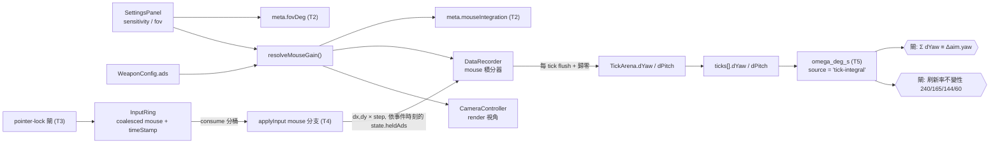

# KI-005 / A — 選項 A 落地(tech spec)

> **範圍**:[KI-005](../KI-005-omega-render-sim-aliasing.md) §6.1 拍板的**選項 A**(tick 窗內積分 mouse delta)+ §6.2 的 `meta.fovDeg` 補欄。診斷、根因(測試 A)、修法拍板(選項 A / 感度由 meta 重建 / 不做過渡期 C)為上游權威,本檔**不重述診斷**,只定義「A 要改什麼、介面長什麼樣、怎麼證明修對了」。
> **決策帳本**:[BUGFIX-DECISIONS.md](../BUGFIX-DECISIONS.md) BD-005 · **協議**:[CLAUDE.md §3](../../../CLAUDE.md) · **術語**:[CONTEXT.md](../../../CONTEXT.md)
> **狀態**:⬜ 計畫已定,尚未動任何程式碼。
> 語言:繁體中文,技術術語保留英文(D4)。

---

## 0. 一句話

把「角位移歸屬到哪個 tick」的權威,從 **render 速率的 zero-order-hold 階梯**(`state.aim` 被 128 Hz 取樣後差分)換成**事件自身的 `timeStamp`**——[`consume`](../../../src/input/consume.ts) 早已依 `event.timeStamp` 把滑鼠事件精確分桶到唯一正確的 tick,只是 [`applyInput`](../../../src/loop/SimLoop.ts#L66) 目前把它們直接丟棄;同時補上 `meta.fovDeg`,關掉「ADS 感度鏈不可稽核」這個獨立於 KI-005 的可重現性漏洞。

修好之後,ω(t) 在**結構上**不可能有 beat aliasing,且與 `displayHz` 無關——受試者的螢幕刷新率不再是未受控 confound。

---

## 1. 需求壓縮 (Requirements)

### 1.1 Functional Requirements

| # | 需求 | 來源 |
|---|---|---|
| **FR-A-1** | 系統必須在每個 sim tick 窗 `[tickStart, tickEnd)` 內,依每筆 mouse 事件**自身 `timeStamp`** 累加該窗的角位移,產出 `dYaw` / `dPitch`(rad),**不讀 render 幀時間、不讀時鐘**。 | KI-005 §6.3 選項 A |
| **FR-A-2** | `RAD_PER_COUNT`(0.022°/count)與 `MAX_PITCH` 必須升為**單一來源**常數;repo 內不得存在第二份字面值作為 counts→rad 換算或 pitch 夾角用途。 | 比照 KI-004 FR-S1-1 |
| **FR-A-3** | 角度累加(yaw 遞減、pitch 夾 ±`MAX_PITCH`)必須是**唯一實作**,[`CameraController`](../../../src/view/CameraController.ts) 與 tick 積分器共用;感度 gain 必須由純函式 `resolveMouseGain({ sensitivity, hipFovDeg, ads })` 產出,`CameraController.#adsGain` 改為消費它。 | 防 KI-004 D2 類「兩處各算一套」復發 |
| **FR-A-4** | `TickRecord` 必須新增 optional `dYaw` / `dPitch`;**opt-in 關閉時匯出逐位不變**(比照 `recordKeyEvents`)。 | KI-005 §6.3 · CLAUDE.md §4 |
| **FR-A-5** | 匯出必須記錄 `meta.fovDeg`(hip 基準 FOV,additive),使 ADS gain = `sensitivityRatio × (adsFovDeg / fovDeg)` 可離線重建。 | KI-005 §6.2 |
| **FR-A-6** | 匯出必須**自我描述**積分模型:`meta.mouseIntegration = { model, radPerCount, hipStep, adsStep }`,使離線消費者能判定該匯出是否帶乾淨 ω,而不必靠約定猜。 | 比照 KI-004 FR-S1-13 |
| **FR-A-7** | **正式 app 路徑([main.ts](../../../src/main.ts))必須啟用**該記錄。opt-in 只保 golden/決定性逐位不變,不得成為「功能上線但實務未生效」。 | §2.4 ② 的前車之鑑 |
| **FR-A-8** | mouse 樣本入 ring 必須套用與 fire / ads **相同的 pointer-lock 閘**。 | §2.4 ① 新發現 |
| **FR-A-9** | 必須新增**守恆閘**:同一輸入序列下 `Σ dYaw` 與 `aim.yaw` 的淨變化逐位一致(hip-only)。證明修的是**歸屬**而非量值。 | KI-005 §7.4 ④ |
| **FR-A-10** | 必須新增**刷新率不變性閘**:同一 mouse 事件序列以 240 / 165 / 144 / 60 Hz 的 pump 節奏餵入,`dYaw`/`dPitch` **逐位相同**;同組資料的現行 aim-diff ω 在修法前必須為紅。 | KI-005 §7.2 強化版 |
| **FR-A-11** | Python `omega_deg_s` 必須優先使用 `d_yaw`/`d_pitch`,缺席時退回 aim 差分,並**具名揭露 source**(`tick-integral` / `aim-diff-legacy`)+ 支援 strict 模式。 | C-D4 · 比照 `EyeOriginSource` |
| **FR-A-12** | [`loader.py`](../../../research/src/modules/ingest/algorithms/loader.py) 的 `TICK_COLUMNS` 必須容納新欄位,且對缺欄的舊匯出不報錯。 | C-D1 |
| **FR-A-13** | [`schema.md`](../../operational/schema.md) 與 [`analysis-segments.md`](../../operational/analysis-segments.md) 的 ω 定義段必須同步——ω(t) 只能有**一個**定義。 | C-D4 |
| **FR-A-14** | 帳本對帳:KI-005 狀態、BD-005 落地段、M14 ③④⑤ 的**解除條件**明文化(**非**重新宣告——那需要新採樣)。 | CLAUDE.md §3.9 |

### 1.2 Non-functional Requirements

| # | 需求 | 量化指標 |
|---|---|---|
| **NFR-A-1** | sim 決定性零影響 | `git diff` 不觸及 `src/sim/`、`SharedState` **演進邏輯**、`simStep` 狀態轉移;`applyInput` 的 mouse 分支**只寫 recorder、不寫 `state`**。既有決定性回歸逐位綠 |
| **NFR-A-2** | opt-in 關閉時匯出 **byte-identical** | 既有 golden 逐位不變;`npm run test:ci` 除新增測試外**零期望值變更** |
| **NFR-A-3** | render 逐位不變 | `AimIntegrator` 抽取為純重構:四場景 camera 每幀 quaternion 逐位相同 |
| **NFR-A-4** | 刷新率不變性 | 240 / 165 / 144 / 60 Hz 四種 pump 節奏下 `dYaw`/`dPitch` 差 = **0**(逐位,非容差) |
| **NFR-A-5** | 守恆 | `\|Σ dYaw − Δaim.yaw\| ≤ 1e-12` rad(hip-only 合成序列;目標值 0) |
| **NFR-A-6** | RED 基線可量化 | 修法前,現行 aim-diff ω 在 240 Hz pump 的**等速**輸入下:1 幀 tick 與 2 幀 tick 的正規化 ω ≈ **0.533 / 1.067**、1 幀 tick 佔比 ≈ **12.5%**(KI-005 §3.3)。修法後同組輸入的 `dYaw` 變異係數 ≤ 1e-9 |
| **NFR-A-7** | GC 紀律 | 積分器 = 兩個 Float64 累加器;arena 兩個 preallocated 欄。熱路徑(`applyInput` mouse 分支)**零物件配置** |
| **NFR-A-8** | 回歸零紅 | `npx tsc --noEmit` exit 0 · `npm run test:ci` exit 0 · `uv run pytest` exit 0 |

### 1.3 Constraints(不可違反)

- **C-1** — **ADR-2 三迴圈邊界**:積分器落在 **sim 消費端 → data 層**,**不得**從 render 讀值。`CameraController` 維持 render-only,不得回寫量測資料。
- **C-2** — **ADR-4**:一律 `event.timeStamp` / `performance.now()`,禁 `Date.now()`。積分器不讀任何時鐘(時間資訊全部來自事件本身與 tick 邊界)。
- **C-3** — **GD-16**:ADS 只落輸入/render/data 層,不得改 `SIM_HZ`、目標演進、命中幾何或彈道語意。
- **C-4** — **C-D1**:`research/` 不得 import 任何 TS 模組。`RAD_PER_COUNT` 的 Python 端若需要,以 module 常數 + 匯出的 `meta.mouseIntegration.radPerCount` **對帳**(不靠人工同步)。
- **C-5** — **C-D4**:ω(t) 是既有構念,**不得產生第二定義**。新舊路徑必須算同一個量,差別只在「樣本歸屬」;任何語意差異須入帳(見 §2.5 D-A2 / D-A3)。
- **C-6** — **BD-001 的 TDD 偏離慣例**:紅測試先在工作區證實為紅,再修法轉綠,紅+綠合併為**單一已驗證綠的 commit**(repo 硬規「每個 commit 綠」)。
- **C-7** — **固定佈局紀律**(CLAUDE.md §4):`DataRecorder` = preallocated arena,新增欄位一律 typed array 預配置,不 `push`、不 realloc。

### 1.4 In scope / Out of scope

**In scope**

- `src/input/mouseGain.ts`(新:`RAD_PER_COUNT` / `MAX_PITCH` / `resolveMouseGain` / `createAimIntegrator`)
- `src/view/CameraController.ts`(改為消費上述單一來源;render 逐位不變)
- `src/input/InputSampler.ts`(FR-A-8 的 pointer-lock 閘)
- `src/loop/SimLoop.ts`(`applyInput` 的 mouse 分支)
- `src/data/DataRecorder.ts` · `src/data/RingBuffer.ts`(累加器 + 兩個 arena 欄 + `TickRecord` optional 欄)
- `src/data/metadata.ts` · `src/data/export.ts`(`meta.fovDeg` / `meta.mouseIntegration` / ticks 序列化)
- `src/main.ts`(佈線 + **啟用**)
- `research/src/modules/kinematics/algorithms/angular.py`(`omega_deg_s` 新路徑 + source 揭露)· `research/src/modules/ingest/algorithms/loader.py` · `research/src/report/run_pipeline.py`
- `research/fixtures/exports/synthetic_counterstrafe.json` + `research/src/modules/ingest/algorithms/synthetic.py`(合成 fixture 補欄)
- 新增測試:刷新率不變性閘、守恆閘、opt-in 關閉逐位不變、pointer-lock 閘、camera 逐位不變、新 meta 欄位驗證、Python 雙路徑一致性
- `docs/operational/schema.md` · `docs/operational/analysis-segments.md`(ω 定義段,C-D4 要求的同步)
- 帳本/里程碑對帳:KI-005 狀態、BD-005、[MAP.md](../../MAP.md)、[exec-plan/README.md](../../exec-plan/README.md) 的 M14 列

**Out of scope**(明確排除,防範圍蔓延)

| 排除項 | 歸屬 |
|---|---|
| **選項 B**(原始 ~1000 Hz mouse sample stream) | OQ-KI5-2 拍板**延後**;WP-31 開工前再議(TD-1) |
| **選項 C**(回溯清洗既有 08:03 / 09:39 兩份匯出) | OQ-KI5-3 拍板**不做** |
| **新採樣本身** | **Stage A2**,需真人執行(OQ-KI5-6 / OQ-A-5) |
| **`seg-v2` 重掃 / M14 ③④⑤ 重新宣告** | **Stage A2**,需修法後的新匯出 |
| `beat_period_ticks` 進 `meta.display.gate` | OQ-KI5-5 未決,可另案 |
| 一併開啟 `recordKeyEvents` | OQ-A-2:本次**不做**(不擴大範圍);屬 KI-006 的採集設計,須在 A2-T1 採樣前決定 |
| 任何 sim 演進 / hitbox / 彈道 / 命中語意改動 | 不做(NFR-A-1、C-3) |
| `ticks[].aim` 的既有語意 / 欄位 | **一律不動**——絕對值、命中判定、`fire.offsetDeg`、ε(t) 全部依賴它且不受此 bug 影響(KI-005 §2) |

---

## 2. 技術設計 (Technical Design)

### 2.1 System boundary

```
render path (rAF ≈ 240 Hz)                       sim path (128 Hz)
──────────────────────────                       ─────────────────
pointerLock.onMove                               InputRing(每筆帶自身 timeStamp)
        │                                                │
        ▼                                                ▼  consume() 依 timeStamp 精確分桶
CameraController.applyDelta ──┐                  applyInput(mouse)  ← 目前**直接丟棄**
        │                     │                          │
        ▼                     │                          ▼
   state.aim(ZOH 階梯)        │                 recorder 累加 dYaw/dPitch
        │                     │                          │
        ▼                     │                          ▼
   ticks[].aim                │                  ticks[].dYaw / dPitch
        ↑                     │                          ↑
  被 128 Hz 取樣後差分         │                  結構上不可能 alias
  = KI-005 根因               │                  且與 displayHz 無關
                              │                          │
                              └── 共用 AimIntegrator ─────┘
                                  + resolveMouseGain(FR-A-3)
```

A 的工作 = **接上一條新的、乾淨的逐 tick 差分來源**,而不是修改既有的 `ticks[].aim`。既有欄位一律不動。

### 2.2 Data flow



### 2.3 Interface contracts — TypeScript

```ts
// src/input/mouseGain.ts —— 新增(FR-A-2/3)

/** CS2 counts→radians 固定線性係數(GD-5:0.022°/count)。**唯一定義**。 */
export const RAD_PER_COUNT: number;

/** pitch 夾角 ±89°(Math.PI/2 − 0.01);原為 CameraController 的 module 常數,升為共用。 */
export const MAX_PITCH: number;

export interface MouseGainInput {
  /** SettingsPanel 的 sensitivity(正有限)。 */
  sensitivity: number;
  /** hip 基準垂直 FOV(度)—— 即匯出的 `meta.fovDeg`。 */
  hipFovDeg: number;
  /** 當前武器的 ADS 光學;undefined = 該武器不可開鏡(adsStep === hipStep)。 */
  ads?: { fovDeg: number; sensitivityRatio: number };
}

export interface MouseGain {
  /** hip 態每 count 的 rad = sensitivity × RAD_PER_COUNT。 */
  hipStep: number;
  /** ADS 態每 count 的 rad = hipStep × sensitivityRatio × (ads.fovDeg / hipFovDeg);無 ads config 時 = hipStep。 */
  adsStep: number;
}

/**
 * 感度換算的唯一實作(GD-16 的 gain 公式)。純函式、無副作用、不讀時鐘。
 * `CameraController.#adsGain` 與 tick 積分器**共用同一結果**,故兩者不可能發散。
 * @throws sensitivity / hipFovDeg 非正有限數,或 ads 欄位非正有限數。
 */
export function resolveMouseGain(input: MouseGainInput): MouseGain;

/**
 * 角度累加的唯一實作:yaw 無界遞減(`yaw -= dx × step`)、pitch 夾 ±MAX_PITCH。
 * CameraController 與 tick 積分器各持一個實例,消費**同一條事件流的兩種切分**
 * (render 走 pointerLock.onMove 的 dispatched event;量測走 InputRing 的 coalesced 樣本)。
 */
export interface AimIntegrator {
  readonly yaw: number;
  readonly pitch: number;
  /**
   * 套用一次 delta,回傳**實際生效**的角度差(dPitch 已含夾角效果 ⇒ Σ dPitch ≡ Δpitch,見 D-A2)。
   * 純數值運算,零配置(回傳值由呼叫端就地讀取,實作以重用物件承載)。
   */
  applyDelta(dx: number, dy: number, step: number): { dYaw: number; dPitch: number };
  reset(yaw?: number, pitch?: number): void;
}

export function createAimIntegrator(): AimIntegrator;
```

```ts
// src/data/DataRecorder.ts —— additive 擴充(FR-A-4)

export interface MouseIntegrationConfig {
  gain: MouseGain;
}

export interface DataRecorderOptions {
  /* ...既有欄位逐條不動... */
  /** 啟用 tick 窗 mouse 積分;省略 = 關閉 ⇒ 匯出逐位不變(NFR-A-2)。 */
  mouseIntegration?: MouseIntegrationConfig;
}

export interface DataRecorder {
  /* ...既有欄位逐條不動... */
  /** 未啟用時為 undefined;`applyInput` 以此判定是否進入 mouse 分支(比照 recordKeyEvents)。 */
  readonly mouseIntegration?: MouseIntegrationConfig;
  /**
   * drill 開始時由 main.ts 以當前 settings / weapon 重新佈線。
   * SettingsPanel 於 Pointer Lock 鎖定中整組隱藏(KI-003 的 `#top-left-controls`)⇒ drill 內
   * sensitivity / FOV 不可能變動,單一快照即足夠(KI-005 §6.2)。
   */
  configureMouseIntegration(config: MouseIntegrationConfig | undefined): void;
  /**
   * `applyInput` 專用:依事件自身順序累加進當前 tick 的累加器。
   * `ads` 取**事件時刻**的 `state.heldAds`(ads 事件與 mouse 事件在同一 consume 迴圈內依 timeStamp 排序)。
   */
  accumulateMouse(dx: number, dy: number, ads: boolean): void;
}
```

```ts
// src/data/RingBuffer.ts —— additive(FR-A-4)

export interface TickRecord {
  /* ...既有欄位逐條不動... */
  /** 本 tick 窗內積分的 yaw 角位移(rad)。缺席 = 未啟用 mouse 積分的匯出。 */
  dYaw?: number;
  /** 本 tick 窗內積分的 pitch 角位移(rad,**已含** ±MAX_PITCH 夾角效果,見 D-A2)。 */
  dPitch?: number;
}
```

```ts
// src/data/metadata.ts —— additive(FR-A-5/6);schemaVersion 維持 2

export interface Meta {
  /* ...既有欄位逐條不動... */

  /**
   * hip 基準垂直 FOV(度)(FR-A-5)。ADS gain 的分母:
   * `sensitivityRatio × (weapon.ads.fovDeg / fovDeg)`。缺席 = pre-KI-005 匯出
   * ⇒ 該匯出的 ADS 期間感度鏈**不可稽核**(KI-005 §6.2 的獨立漏洞)。
   * 來源 = `settingsPanel.fov`,**不得**從 `camera.fov` 讀(ADS FOV 內插中值會污染)。
   */
  fovDeg?: number;

  /**
   * 逐 tick 角位移的產生模型(FR-A-6)。缺席 ⇒ `ticks[].dYaw` 亦缺席,離線消費者必須
   * 退回 aim 差分並**標記 source**(該路徑帶 KI-005 的 ZOH aliasing)。
   */
  mouseIntegration?: {
    model: 'tick-window-integral';
    /** counts→rad 係數,供 raw counts 反推(D-A1)與 Python 端對帳(C-4/TD-4)。 */
    radPerCount: number;
    /** hip 態每 count 的 rad。 */
    hipStep: number;
    /** ADS 態每 count 的 rad。 */
    adsStep: number;
  };
}
```

### 2.4 兩個**在計畫階段查碼才發現**的缺口

> 性質同 KI-005 §6.2 發現 `meta.fovDeg` 缺席——不補就是把洞延後成下一個 KI。

#### ① `pushMouse` 沒有 pointer-lock 閘(FR-A-8,T3)

[`InputSampler.onPointerMove`](../../../src/input/InputSampler.ts#L132) **無條件**把 coalesced 樣本推進 ring,而 `onMouseDown`(fire)與 ads 都走 `isLocked()` 閘,理由是「否則取鎖點擊與 UI 點擊會被誤判」。

目前無害——`applyInput` 丟棄 mouse 事件。但**選項 A 落地後,未鎖定時的滑鼠移動會被積分成角位移,而 camera 根本沒轉**:守恆閘(FR-A-9)必破,ω(t) 會出現幽靈峰。必須在 T3 補上同一道閘,理由與 fire/ads 逐字相同。

#### ② `main.ts` 從未啟用 `recordKeyEvents`(FR-A-7 的前車之鑑)

[main.ts:342](../../../src/main.ts#L342) 是 `createDataRecorder({ simHz: SIM_HZ })`——WP-29 / T3 的 `recordKeyEvents` opt-in 旗標**在正式 app 路徑上是關閉的**,功能上線但實務未生效。

若 KI-005 照抄「比照 `recordKeyEvents` 做 opt-in」而不動 `main.ts`,**新採樣仍然不會帶 `dYaw`,整個修法對研究零效果**。故 FR-A-7 明列:API 層 opt-in(保 golden 與決定性逐位不變),**app 佈線層必須開啟**。

### 2.5 語意決策(三個必須明文的取捨)

| # | 取捨 | 決定 | 理由 |
|---|---|---|---|
| **D-A1** | 記 raw counts(Σdx/Σdy)還是記 rad? | **記 rad** | KI-005 §6.3 拍板文字即 `sensitivity × RAD_PER_COUNT × adsGain` 累加;且 `meta.mouseIntegration` 同時記下 `radPerCount`/`hipStep`/`adsStep` ⇒ raw counts 仍可反推,**無資訊損失**。改記 counts 會讓每個消費端各自重做換算,反而是 C-D4 的風險面 |
| **D-A2** | `dPitch` 是否套用 ±`MAX_PITCH` 夾角? | **套用** | ω(t) 的既有構念是**視角**角速度,不是手部意圖。不夾即產生第二定義(踩 C-5(= C-D4)),且 `Σ dPitch ≢ Δaim.pitch` 會使守恆閘(FR-A-9)失效。殘餘影響見 OQ-A-3 |
| **D-A3** | 新欄位讓 `omega[0]` 從 `nan` 變成有定義(tick 0 有自己的窗),是否改 `omega_deg_s` 契約? | **不改**,維持 index 0 = `nan` | [analysis-segments.md](../../operational/analysis-segments.md) 與 D-28.12(`omega[1:]`)已凍結;為一個樣本改契約會連動 `seg-v1` 參數與所有既有測試。多出的樣本**刻意捨棄**,於 doc 留 `TODO`(TD-3) |

### 2.6 Failure modes

| # | 觸發條件 | 影響 | 處理策略 |
|---|---|---|---|
| **FM-1** | `getCoalescedEvents()` 的分量總和 ≠ 該次 dispatched event 的 `movementX/Y` | `Σ dYaw ≠ Δaim.yaw`(**僅真實資料**;合成注入路徑必然相等) | 守恆閘在合成上為 exact;**A2-T2 在新匯出上做同一檢查**——這是本次落地內**唯一無法證偽的假設**。若不成立即代表 render 與量測看到不同的輸入流 ⇒ **立即把選項 B 提前**(它是唯一能仲裁的資料) |
| **FM-2** | ADS 切換瞬間:camera 的 gain 階躍量化到 **render 幀**([CameraController.setAds](../../../src/view/CameraController.ts#L144) 每幀由 render loop 呼叫),積分器量化到**事件時刻** | 切換那一幀的角位移歸屬有殘差 | 守恆閘限定 **hip-only** 樣本為 exact;含 ADS 切換的樣本以「切換 tick 排除」宣告,記為 TD-2(選項 B 可根治)。現有兩份真實樣本全程未開鏡,不影響當期 |
| **FM-3** | `AimIntegrator` 抽取意外改動 camera 的數值路徑 | render 行為變更、e2e / 決定性 fixture 全面偏移 | T1 **先**以四場景 camera quaternion 逐位斷言封裝為 golden,**再**重構;T1 的 DoD 要求「零既有測試期望值變更」 |
| **FM-4** | `main.ts` 啟用後,既有 e2e round-trip 匯出多出兩欄 | 綠測試轉紅,可能被誤判為迴歸 | 每一條變動的期望值**逐條書面歸因**於「新增 additive 欄」並記入 `progress.md`;**不得**為求綠而關掉 app 的旗標(那會直接違反 FR-A-7) |
| **FM-5** | Python 雙路徑(新欄 / 回退)語意漂移 | ω 出現第二定義(踩 C-5(= C-D4)) | 兩路徑共用同一數學核心,只差輸入來源;`source` 旗標必回傳;以「同一份合成資料兩路徑結果一致」的測試釘死 |
| **FM-6** | 設定面板在 drill 進行中被改到 sensitivity / FOV | `meta.fovDeg` / gain 與實際不符 | 鎖定中整組隱藏(KI-003);補測試釘死「drill 進行中 `configureMouseIntegration` 不被重呼」 |
| **FM-7** | `ticks` CSV 無條件新增兩欄 | 既有 CSV golden 全紅 | `serializeTicksCSV` 依 payload 是否含 `dYaw` 決定表頭——缺席時與今日**逐位相同** |
| **FM-8** | pointer-lock 閘(T3)改變 `inputMeta.bufferOverflow` 統計口徑 | 舊資料的 overflow 數不可直接比較 | 只會**減少**入 ring 事件(不會增加);以測試釘死「鎖定中逐位不變、未鎖定時不入 ring」,並在 `schema.md` 註記口徑變更日期 |

### 2.7 Concurrency model

**不適用**。全部落在單執行緒 sim 消費端(`consume` → `applyInput`)與純函式。不新增跨迴圈通訊;積分器狀態屬 **data 層**(`DataRecorder` 閉包),**不進 `SharedState`**——這是保住 NFR-A-1「`SharedState` 演進零 diff」的關鍵設計選擇,也使 ADR-2 三迴圈邊界不變。

---

## 3. 風險分析 (Risk Analysis)

### 3.1 風險登錄

| # | 風險 | 等級 | 說明 / 緩解 |
|---|---|---|---|
| **R-1** | `AimIntegrator` 抽取動到 render 熱路徑 | **High** | FM-3 的逐位 golden 先行;T1 DoD 要求零測試期望值變更。若無法做到逐位不變,即代表抽取改變了浮點運算順序 ⇒ 停,改為「積分器獨立實作 + 守恆閘綁定」 |
| **R-2** | coalesced sum ≠ dispatched movement(FM-1) | **High** | 本次落地內**無法**證偽的唯一假設。合成閘 exact + A2-T2 真實資料守恆檢查;明列為「A2 才能關閉的假設」,不假裝已解決 |
| **R-3** | `main.ts` 啟用讓所有新匯出改變形狀 | Med | 三個欄位皆 optional additive;`schemaVersion` 維持 2;缺欄的舊匯出載入路徑有測試(FR-A-12) |
| **R-4** | ADS 期間的歸屬殘差(FM-2) | Med | hip-only 宣告 + TD-2 登錄;現有樣本不受影響。WP-24 ADS drill 進分析前必須複查 |
| **R-5** | Python 雙路徑 = 第二定義風險 | Med | FM-5;`source` 寫進 `pipeline-summary.json` 使每次跑都自曝用了哪條路 |
| **R-6** | 本次落地**無法**讓 M14 ③④⑤ 重新宣告 | Med | 誠實分 Stage A1 / A2;A1 的 exit gate **不含**任何 M14 宣告,只交付「解除條件」。且 M14 ④⑤ 另被 [KI-006](../KI-006-m14-sample-no-counterstrafe.md) 獨立擋住 |
| **R-7** | pointer-lock 閘改變 `bufferOverflow` 口徑 | Low | FM-8;只減不增,以測試釘死 |
| **R-8** | 新增兩個 `Float64Array` 欄位增加 arena 記憶體 | Low | 300 s × 128 Hz 容量下約 +0.6 MB,固定預配置、無 realloc(C-7);opt-in 關閉時仍配置但不寫入(維持固定佈局紀律,不做條件配置) |

### 3.2 Technical debt(有意識的妥協)

| # | 妥協 | 原因 | 後續處理 | 觸發條件 |
|---|---|---|---|---|
| **TD-1** | 仍是 **128 Hz** 解析度 | 選項 A 修的是**錯誤**,不是解析度。128 Hz 下 200 ms flick 僅 25 點,3–4 點寬的修正動作無法分辨 | **選項 B**(~1000 Hz raw sample stream,KI-005 §6.3) | WP-31 的 submovement 分解 / SPARC / Fitts 開工前 |
| **TD-2** | ADS 切換幀的歸屬殘差(FM-2) | 根治需 render 側也走事件時刻,屬選項 B 的範圍 | 選項 B | WP-24 ADS drill 進入分析時 |
| **TD-3** | `omega[0]` 已有值但刻意捨棄(D-A3) | 保 `seg-v1` / D-28.12 的凍結契約 | `seg-v2` 重掃(A2-T3)時一併決定 | Stage A2 |
| **TD-4** | Python 端 `RAD_PER_COUNT` 為獨立常數 | C-D1 禁止 Python import TS | 以 `meta.mouseIntegration.radPerCount` 對帳(**匯出自我描述**,不靠人工同步);與 KI-004 TD-3 同一模式 | 若 Python 端需要 counts 反推時 |
| ~~**TD-5**~~ | ~~`recordKeyEvents` 仍未在 app 啟用(OQ-A-2)~~ | 本次(A1)刻意不擴大範圍 | ✅ **已落地(2026-08-07)**:`main.ts:355` 的 `createDataRecorder(...)` 已傳入 `recordKeyEvents: true`;`tests/e2e/input-sampler.spec.ts` 新增案直讀 `__aimDebug.recorder.recordKeyEvents === true`(比照 FR-A-7 模式)。回歸:`tsc --noEmit` exit 0、`npm run test:ci` Vitest 89 files/739 tests 不變 + Playwright **21/21**(新增 1 案)、`uv run pytest` 221 passed 不變 | 無(已解除) |

---

## 4. 任務拆解 (Task Breakdown)

> 每個 task = 一個垂直切片 = 一個原子 commit(CLAUDE.md §3.1)。當前 task 未 commit 不開下一個。
> 完整逐步驟 / DoD / commit message 見各 task 檔;本表為索引與相依。

### Stage A1 —— 可立即落地(**不需新資料**)

| Task | 目標 | 相依 | 風險 | 複雜度 | Definition of Done(摘要,權威在 task 檔) |
|---|---|---|---|---|---|
| [T0](T0-entry-gate.md) | Entry gate:基線紅綠燈 · 受影響測試清單 · 把 KI-005 §3.1/§3.3 的凹口偵測與幀數比對寫成**可重跑腳本**作為 RED 證據 | — | Low | Low | 三條基線指令 exit 0 記錄在案;09:39 匯出跑偵測器回傳 34 個凹口(間距眾數 8)可重現;受影響測試清單 + 現值寫入 `progress.md`;§2.4 兩個缺口以行號複核確認 |
| [T1](T1-mouse-gain-single-source.md) | `mouseGain.ts` 單一來源 + `CameraController` 改為消費(FR-A-2/3) | T0 | **High** | Med | `grep` 確認 `0.022` 與 pitch 夾角只剩一處定義;四場景 camera 每幀 quaternion 逐位不變(新測試逐條斷言);**零既有測試期望值變更**;`tsc --noEmit` exit 0 |
| [T2](T2-export-meta-additive.md) | 匯出自我描述:`meta.fovDeg` + `meta.mouseIntegration`(FR-A-5/6) | T1 | Low | Low | 兩者 optional additive、`schemaVersion` 維持 2;`meta.suspect` 逐位不變;`fovDeg` 取自 `settingsPanel.fov`(**不**讀 `camera.fov`,`git diff` 複查);`schema.md` 記錄;validator 拒絕案齊備 |
| [T3](T3-pointer-lock-gate.md) | `pushMouse` 補 pointer-lock 閘(FR-A-8) | T2 | Low | Low | 未鎖定時 `pointermove` 不入 ring(新測試);鎖定中入 ring 行為**逐位不變**;`bufferOverflow` 口徑變更記入 `progress.md` 與 `schema.md` |
| [T4](T4-tick-window-integration.md) | **tick 窗積分**:`applyInput` mouse 分支 + recorder 累加器 + arena 兩欄 + `main.ts` **啟用** + 三個閘(FR-A-1/4/7/9/10) | T3 | **High** | High | 刷新率不變性閘:四種 pump 節奏下 `dYaw` **逐位相同**,且同組資料的 aim-diff ω 在修法前為紅(比值 0.533/1.067、佔比 12.5%,證據記 `progress.md`);守恆閘 ≤ 1e-12(hip-only);opt-in 關閉時匯出 byte-identical;`main.ts` 已啟用且 e2e round-trip 匯出含新欄;`git diff` 不觸及 `src/sim/`、`SharedState` 演進、`simStep` |
| [T5](T5-python-omega-source.md) | Python:`omega_deg_s` 新欄位路徑 + `source` 揭露 + strict + `loader` 欄位 + 合成 fixture 補欄(FR-A-11/12) | T4 | Med | Med | 同一份合成資料兩路徑數值一致(證明無第二定義);缺欄舊匯出仍可載入且 `source == 'aim-diff-legacy'`;`run_pipeline` 走 strict 並把 `source` 寫進 `pipeline-summary.json`;`uv run pytest` exit 0 **且** `npm run test:ci` exit 0 |
| [T6](T6-docs-ledger-reconcile.md) | 文件 / 帳本對帳(FR-A-13/14) | T5 | Low | Low | `analysis-segments.md` 的 ω 定義段更新(含 D-A3 的 `TODO`)· `schema.md` 三處新欄 · KI-005 狀態翻「✅ 選項 A 已落地;A2 待新採樣」· BD-005 補落地段(含 §2.4 兩個新發現)· MAP.md / exec-plan README 的 M14 列標明**解除條件** |
| [T-exit](T-exit-gate.md) | A1 exit gate:交付判定 | T6 | Low | Low | §6 的八道硬閘逐條打勾附證據;NFR 全數量化達標;無 open red |

**相依圖**

```
T0 ──► T1 ──► T2 ──► T3 ──► T4 ──► T5 ──► T6 ──► T-exit
        │      │       │      ▲
        │      │       └──────┤ lock 閘必須先於積分(否則幽靈角位移)
        │      └──────────────┤ meta 欄位是 T4 啟用時的自我描述前提
        └─────────────────────┘ gain / 積分器單一來源是 T4 的前提
```

嚴格序列化。T1–T4 都動 `main.ts`,並行只會製造衝突。

**commit 顆粒度**:T5 的合成 fixture 補欄會讓依賴該 fixture 的 Python 測試期望值變動。若 T4 先行改動合成 fixture,則 **T4 + T5 合併為單一已驗證綠的 commit**(比照 [BD-001](../BUGFIX-DECISIONS.md) 的 TDD 偏離慣例);若把 fixture 補欄全部留在 T5,則 T4 可獨立綠燈 commit。實作時擇一,並記入 `progress.md` 與 BD-005。

### Stage A2 —— **blocked on 新採樣**(見 [A2-blocked-plan.md](A2-blocked-plan.md))

| Task | 目標 | 阻塞於 |
|---|---|---|
| **A2-T1** | 新採樣(同一台 240 Hz 機器;與 KI-006 選項 B 合流) | 研究者排程(OQ-A-5) |
| **A2-T2** | KI-005 §7.4 的四項複驗(**含關閉 FM-1 假設**) | A2-T1 |
| **A2-T3** | `seg-v2` 重掃 + 凍結(D-28.7 不得原地調參) | A2-T2 |
| **A2-T4** | M14 ③④⑤ 重新宣告 | A2-T3 **+ KI-006 獨立解除** |

### FR → Task 對應完整性檢查

| FR | Task | | FR | Task |
|---|---|---|---|---|
| FR-A-1 | T4 | | FR-A-8 | T3 |
| FR-A-2 | T1 | | FR-A-9 | T4 |
| FR-A-3 | T1 | | FR-A-10 | T4 |
| FR-A-4 | T4 | | FR-A-11 | T5 |
| FR-A-5 | T2 | | FR-A-12 | T5 |
| FR-A-6 | T2 | | FR-A-13 | T6 |
| FR-A-7 | T4 | | FR-A-14 | T6 |

---

## 5. Open Questions(A 專屬;KI-005 §8 的 OQ-KI5-* 不重複)

| # | 問題 | 現況 / 決議 | Owner | Deadline | 影響 Task |
|---|---|---|---|---|---|
| ~~**OQ-A-1**~~ | ~~`main.ts` 啟用 mouse 積分是否要做成「實驗 session 才開」?~~ | ✅ **關閉(2026-08-06)**:**全域開**。opt-in 的目的是保 golden 逐位不變,不是保運行時可選;分兩種模式會產生「哪些 run 有 ω」的新不確定性 | 使用者 | — | T4 |
| ~~**OQ-A-2**~~ | ~~既然要動 `main.ts` 的 recorder 佈線,是否一併開啟 `recordKeyEvents`?~~ | ✅ **關閉(2026-08-06)**:本次**否**(不擴大範圍)。**A2-T1 採樣前再決策(2026-08-07):開**,已落地(TD-5) | 使用者 → 研究者 | ✅ 已決且已落地 | A2-T1 |
| **OQ-A-3** | D-A2(dPitch 套夾角)在受試者長時間看天/地時,ω 會出現「手在動但視角不動」的 0 值。是否需要 quality flag? | 🟡 建議**先不加**——`pitch` 是否貼齊 ±`MAX_PITCH` 事後可由 `ticks[].aim.pitch` 判定,不需新欄位;若 pilot 實際出現再補 | 研究者 | A2-T2 | — |
| **OQ-A-4** | 是否把 `beat_period_ticks` 加進 `meta.display.gate`(= 上游 OQ-KI5-5) | 🟡 **未決**。A 落地後價值降為「稽核舊匯出 + 偵測未來回歸」,不阻塞 A1 | 使用者 | — | 無(可另案) |
| ~~**OQ-A-5**~~ | ~~新採樣的時機與規模(= 上游 OQ-KI5-6):是否與 KI-006 選項 B 合併,並順帶滿足 OQ-KI6-4(n ≥ 2 session)~~ | ✅ **關閉(2026-08-07)**:**合併為同一次採集**;規模 = n > 2 session(OQ-KI6-4 決議) | 研究者 | — | A2-T1 |
| **OQ-A-6** | 守恆閘在 ADS 樣本上的容差(FM-2 殘差量級)如何訂? | 🟡 建議 A1 **只宣告 hip-only exact**,ADS 樣本的容差待 A2 有真實 ADS 匯出後再量測 | 實作者 → 研究者 | WP-24 ADS drill 進分析前 | T4 |

---

## 6. A1 Exit Gate(交付判定)

> 逐條可客觀驗證;證據回填 [T-exit-gate.md](T-exit-gate.md)。

| # | 條件 | 驗證方式 |
|---|---|---|
| **G-1** | **刷新率不變性**:240 / 165 / 144 / 60 Hz 四種 pump 節奏下 `dYaw`/`dPitch` **逐位相同**;同組資料的 aim-diff ω 在修法前為紅(比值 ≈ 0.533/1.067、1 幀 tick 佔比 ≈ 12.5%) | `npm run test:ci`;測試輸出含修法前的實測比值 |
| **G-2** | **守恆**:`\|Σ dYaw − Δaim.yaw\| ≤ 1e-12`(hip-only 合成序列) | `npm run test:ci` |
| **G-3** | opt-in 關閉時匯出 **byte-identical**;既有 golden 零變更 | golden 逐位比對 + `git diff` |
| **G-4** | 全套回歸:`npx tsc --noEmit` · `npm run test:ci` · `uv run pytest` 三條 exit 0 | 實際輸出(檔數/案數)記入 progress |
| **G-5** | 決定性零影響:`src/sim/` · `SharedState` 演進 · `simStep` 零 diff;既有決定性回歸逐位綠 | `git diff --stat` + 決定性測試案數對照 T0 基線 |
| **G-6** | render 逐位不變:四場景 camera 每幀 quaternion 相同 | `npm run test:ci` + Playwright |
| **G-7** | **匯出自我描述**:新產生的匯出含 `meta.fovDeg` + `meta.mouseIntegration` + `ticks[].dYaw`,且 `omega_deg_s` 對其解析出 `source == 'tick-integral'`(無需傳參) | round-trip 測試 + `uv run pytest` |
| **G-8** | 未鎖定時的 `pointermove` **不入 ring**;鎖定中逐位不變 | `npm run test:ci` |

> **A1 exit gate 明確不包含 M14 ③④⑤ 的任何重新宣告** —— 那需要 Stage A2 的新採樣,且 M14 ④⑤ 還被 KI-006 獨立擋住。A1 交付的是「**量測儀器修好了**」,不是「效度恢復了」。

---

## 7. 上游引用

| 文件 | 用途 |
|---|---|
| [KI-005](../KI-005-omega-render-sim-aliasing.md) | 診斷、根因(測試 A)、§6.1 修法拍板、§6.2 `meta.fovDeg` 缺口、§7 驗證計畫(本檔的權威上游) |
| [BUGFIX-DECISIONS.md](../BUGFIX-DECISIONS.md) BD-005 | 決策入帳;BD-001 的 TDD 偏離慣例 |
| [KI-004 / S1](../KI-004-S1/README.md) | 本檔的結構範本;`meta` additive 前拉、正確性閘、單一來源常數三個模式直接沿用 |
| [KI-006](../KI-006-m14-sample-no-counterstrafe.md) | M14 ④⑤ 的**第二條獨立**撤回理由;A2-T1 的採樣須與其選項 B 合流 |
| [CLAUDE.md §3 / §4](../../../CLAUDE.md) | 執行協議、硬約束(ADR-2/ADR-4、GD-5/GD-16、C-D1/C-D4、固定佈局紀律) |
| [analysis-segments.md](../../operational/analysis-segments.md) | ω(t) / `seg-v1` 的 prose 權威;T6 同步(C-5 / C-D4) |
| [schema.md](../../operational/schema.md) | 匯出 schema 的 prose 權威;T2 新增 `meta.fovDeg` / `meta.mouseIntegration`,T4 新增 `ticks[].dYaw/dPitch` |
